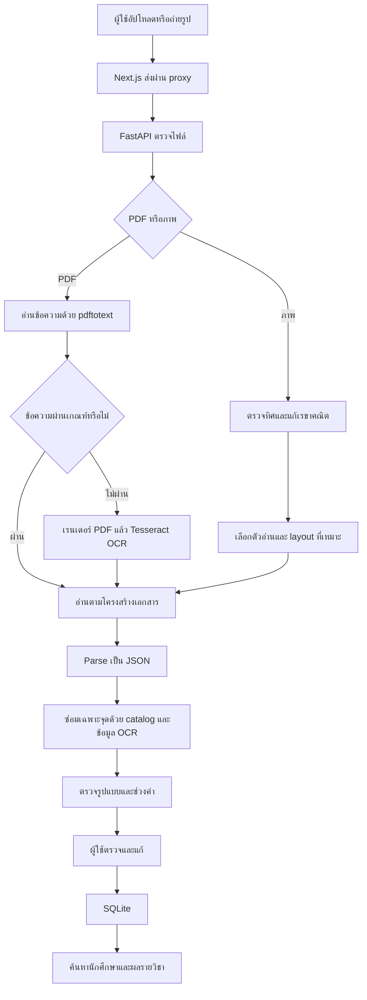
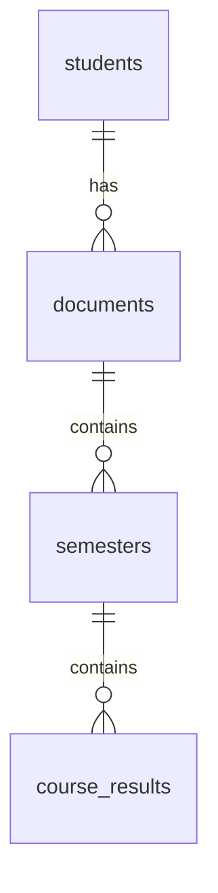

# อธิบายโปรเจกต์ OCR Transcript พร้อมเหตุผลของการออกแบบ

ทบทวนจากไฟล์ใน `C:\isd-2026-loso` วันที่ 10 ตุลาคม 2026

เอกสารนี้เขียนเพื่อให้เข้าใจว่า **งานนี้แก้ปัญหาอะไร ทำงานอย่างไร ทำไมเลือกโมเดลและวิธีเหล่านี้ และผลที่มีอยู่พิสูจน์อะไรได้บ้าง** สามารถใช้เตรียมพรีเซนต์และตอบคำถามได้

การอธิบายจะแยกหลักฐานสามประเภท:

- **มีบันทึกหรือผลทดลองรองรับ**: พบใน Decision Log หรือรายงานผลดิบ
- **พบในโค้ด**: ยืนยันว่าระบบทำอย่างนั้นจริง แต่ไม่ได้แปลว่าค่านั้นดีที่สุด
- **เหตุผลเชิงวิศวกรรม**: อธิบายประโยชน์และข้อแลกเปลี่ยนจากโครงสร้างที่เห็น ไม่อ้างว่าเป็นเหตุผลดั้งเดิมของผู้พัฒนาถ้าไม่มีบันทึก

ขอบเขตการทบทวน: สำรวจไฟล์โปรเจกต์ทั้งหมด โดยไม่นับ `.git`, ไฟล์ติดตั้ง/ไฟล์ build และไฟล์ชั่วคราว; โหลดอ่านไฟล์ข้อความ 361 ไฟล์และตรวจ parse JSON 266 ไฟล์ก่อนสร้างเอกสารนี้ รวม source, config, labels, reports และ package lock. วิเคราะห์รายละเอียดจาก source หลักและรายงานที่อ้างด้านล่าง **ไม่ได้เปิด PDF ตัวอย่าง 48 ฉบับและภาพทุกภาพเพื่อตรวจทีละหน้า ไม่ได้ถอด weights `.traineddata` หรือเปิดอ่านระเบียนใน SQLite** จึงไม่อ้างว่าได้ตรวจค่าที่มองเห็นในเอกสารต้นฉบับทั้งหมดด้วยตนเอง ตัวเลขในเอกสารเป็นผลที่บันทึกอยู่แล้ว ไม่ใช่ benchmark ที่รันใหม่วันนี้

## 1. งานนี้คืออะไร และทำไปทำไม

งานนี้คือระบบแปลงใบแสดงผลการเรียนของ สจล. จาก PDF หรือภาพให้เป็นข้อมูลที่ **ตรวจแก้ บันทึก และค้นหาได้** เช่น รหัสนักศึกษา ชื่อ หลักสูตร ภาคเรียน รหัสวิชา หน่วยกิต เกรด และ GPA

ถ้ามีเพียงไฟล์ PDF คนต้องเปิดดูทีละฉบับแล้วคัดลอกข้อมูลเอง หากต้องการค้นว่า “นักศึกษาคนนี้ได้เกรดอะไรในวิชานี้” การเก็บไฟล์อย่างเดียวไม่ตอบโจทย์ ระบบจึงต้องทำมากกว่าการอ่านข้อความ: ต้องรู้ด้วยว่าข้อความนั้นเป็นข้อมูลช่องไหน อยู่ในแถวไหน และเป็นภาคเรียนใด

ตัวอย่างความผิดพลาดที่สำคัญ: OCR อ่านรหัสวิชาถูกแต่เอาเกรดจากแถวถัดไปมาใส่ ผลลัพธ์ดูเป็นระเบียบและผ่านรูปแบบ แต่ข้อมูลผิด ดังนั้นงานนี้มีทั้งการอ่านตัวอักษร การจัดโครงสร้าง และการตรวจโดยผู้ใช้

**หลักฐาน:** [โครงสร้างระบบ](STRUCTURE.md), [API](../backend/app/main.py), [หน้าเว็บ](../web/app/workspace.tsx)

## 2. ถ้าถามว่า “ใช้โมเดลอะไร” ต้องตอบอย่างไร

คำตอบที่ตรงกับโค้ดคือ:

> ใช้ Tesseract เป็นตัวอ่านภาพ ร่วมกับ Poppler สำหรับข้อความและภาพจาก PDF, OpenCV สำหรับแก้ภาพและหาตาราง, parser ที่ใช้กฎสำหรับแปลงข้อความเป็น JSON และ catalog รายวิชาสำหรับซ่อมข้อความบางช่อง ภาพถ่ายอังกฤษบางแบบใช้ Tesseract LSTM ที่ fine-tune เพิ่มชื่อ `eng_phone` หรือ weights รุ่นก่อนชื่อ `eng_photo`

อย่าเรียกทั้งระบบว่าเป็น neural network ตัวเดียว เพราะหลายขั้นเป็นโปรแกรมที่กำหนดกฎชัดเจน

| ส่วน | ทำหน้าที่อะไร | เป็นโมเดลที่ฝึกหรือไม่ |
|---|---|---|
| `pdftotext` | อ่านข้อความที่ฝังใน PDF | เครื่องมือถอดข้อความ ไม่ใช่โมเดล OCR |
| Tesseract `eng` / `tha+eng` | แปลงภาพตัวอักษรเป็นข้อความ | ใช้ recognizer ที่ฝึกมาแล้ว |
| `eng_phone.traineddata` | อ่านข้อความภาพมือถือในเส้นทางเฉพาะ | fine-tune English LSTM เพิ่มจริง |
| `eng_photo.traineddata` | weights ภาพถ่ายรุ่นก่อนในเส้นทางภาพจอ/ภาพเฉพาะ | ฝึกเพิ่มจริง แต่คนละรุ่นกับ `eng_phone` |
| OpenCV | ขอบกระดาษ มุมมอง เส้นตาราง และบรรทัด | ขั้นเหล่านี้ใช้วิธีประมวลผลภาพ ไม่ได้ฝึก weights ใหม่ |
| Regex/parser | แยกข้อมูลนักศึกษา ภาคเรียน รายวิชา และสรุป | กฎที่เขียนไว้ |
| Course catalog | จับคู่รหัสวิชากับชื่อ และเลือกข้อความมาตรฐาน | เรียนรู้คลังคำจาก dev; ไม่ใช่การ fine-tune neural network |
| Validation | ตรวจรูปแบบและช่วงค่า | กฎที่เขียนไว้ |

คำว่า **Hybrid** ในงานนี้หมายถึงการเลือกใช้ข้อความฝัง PDF ก่อน แล้วใช้ OCR เมื่อข้อความไม่ผ่านเกณฑ์ ไม่ใช่การรวมคำตอบจากโมเดลหลายตัวแบบ ensemble

**หลักฐาน:** [pipeline หลัก](../model/extract.py), [ข้อมูลการฝึกมือถือ](../model/data/phone_ocr/training.json), [ตัวอ่านภาพจอ](../model/screen_table.py)

## 3. ทำไมเลือก Hybrid แทน OCR ทุกไฟล์

PDF บางฉบับมีข้อความอยู่แล้ว ถ้านำ PDF แบบนี้ไปแปลงเป็นภาพแล้ว OCR อีกครั้ง จะเพิ่มโอกาสอ่านผิดจากฟอนต์ เส้นตารางและความละเอียด ทั้งยังใช้เวลาเพิ่ม การอ่านข้อความที่มีอยู่จึงเป็นจุดเริ่มที่เหมาะสม

แต่ไม่ใช่ทุก PDF ที่มี text layer จะอ่านได้ดี บางไฟล์ถอดข้อความแล้วได้อักขระผิด ระบบจึงมี quality gate ก่อนยอมรับข้อความนั้น

ผลทดลองบน PDF dev **8 ฉบับเดียวกัน**:

| เส้นทาง | ฟิลด์ถูก/ทั้งหมด | Exact field accuracy | เวลาเฉลี่ยต่อฉบับ |
|---|---:|---:|---:|
| Hybrid: ข้อความฝังก่อน แล้ว OCR สำรอง | 565/575 | 98.26% | 0.433 วินาที |
| บังคับ Tesseract OCR ทุก PDF | 241/575 | 41.91% | 3.227 วินาที |

ในรอบนี้ Hybrid เร็วกว่าประมาณ 7.45 เท่า และแม่นกว่า จึงมีหลักฐานเชิงทดลองรองรับการเลือก ไม่ใช่เลือกเพราะคุ้นชื่อเครื่องมือ

**ข้อจำกัด:** นี่คือการเทียบสองเส้นทางของระบบในรอบทดลองนั้น ไม่ใช่ข้อสรุปว่า Tesseract ทุก configuration แม่นเพียง 41.91% หรือว่าทุก PDF จะได้ 98.26%

**หลักฐาน:** [ผลเทียบเส้นทาง](../model/reports/route-comparison-dev.json), [สคริปต์ทดลอง](../model/tools/compare_routes.py)

## 4. ทำไมเลือก Tesseract และไม่ใช้ LLM/VLM เป็นตัวหลัก

### 4.1 เหตุผลที่ Tesseract เหมาะกับเส้นทางที่เลือก

ระบบใช้ Tesseract อ่านไทยและอังกฤษได้จากแพ็กเกจที่ติดตั้งใน Docker ทำงานในเครื่อง และเรียกอ่านทั้งหน้า คอลัมน์ หรือบรรทัดได้ เส้นทางมือถือยังสามารถเลือก weights ที่ฝึกเพิ่มด้วย `--tessdata-dir`

ประโยชน์เชิงวิศวกรรมคือไม่มีค่า API ต่อเอกสารในเส้นทางนี้ และสามารถตรวจว่าความผิดพลาดมาจากภาพ การแบ่งแถว หรือการแปลงข้อมูลได้ทีละขั้น อย่างไรก็ตาม **ค่า API 0 USD ไม่เท่ากับต้นทุนทั้งหมดเป็นศูนย์** ยังมีเครื่อง เวลา ไฟฟ้าและการดูแลระบบ

### 4.2 เคยทดลอง VLM จริงหรือไม่

มีการทดลองผ่าน Ollama:

1. `scb10x/typhoon-ocr1.5-3b`: ภาพ → Markdown
2. `qwen3:4b`: Markdown → JSON ตาม schema

ใช้ภาพ PNG 150 DPI จำนวน 4 ฉบับ กระจาย 4 กลุ่มเอกสาร ผลสำเร็จ 1 ฉบับ ได้ 1/75 ฟิลด์ = 1.33% และใช้ 121.1 วินาที อีก 3 ฉบับ timeout ในขั้น OCR ตามรายงาน

เหตุผลที่ไม่ใช้เป็นตัวหลักจึงเป็น **ผลความแม่นยำและเวลาที่ไม่เหมาะกับเป้าหมายบนเครื่อง/configuration ที่ทดลอง** ไม่ใช่ข้ออ้างว่า LLM ทุกตัวอ่านเอกสารไม่ได้

การเทียบ VLM กับ Hybrid ต้องระวังสองอย่าง: VLM รับภาพ PNG ส่วน Hybrid รับ PDF และ scoring ในสคริปต์ VLM จับคู่รายวิชาด้วยรหัส ขณะที่ evaluator หลักจับฟิลด์ตามตำแหน่ง จึงไม่ใช่การแข่งที่เหมือนกันทุกเงื่อนไข

### 4.3 แล้ว PaddleOCR, EasyOCR หรือบริการเสียเงินล่ะ

มีชื่อทางเลือกในเอกสารแผน แต่ไม่พบผลทดลองครบและควบคุมเงื่อนไขเท่ากันพอจะอ้างว่าระบบนี้ชนะทั้งหมด `process.md` บันทึกว่าเคยลอง tessdata_best/RapidOCR ในงานภาพจอแล้วไม่ได้ใช้ในเส้นทางสุดท้าย แต่ไม่มีตารางครบที่รองรับการจัดอันดับทุกเครื่องมือ

คำตอบที่เหมาะสมคือ “เลือกจากทางเลือกที่เราทดลองและข้อจำกัดของงาน” มากกว่า “เลือกตัวที่ดีที่สุดในโลก”

**หลักฐาน:** [ผล VLM](../model/reports/vlm-dev.json), [สคริปต์ VLM](../model/tools/benchmark_vlm.mjs), [บันทึกการตัดสินใจ](process.md)

## 5. ระบบทำงานตั้งแต่ต้นจนจบอย่างไร

ทำไมแยกหลายขั้น: ความผิดพลาดแต่ละชนิดต้องแก้คนละที่ เช่น ภาพเอียงต้องแก้ภาพ แต่หัวภาค OCR เพี้ยนต้องแก้การรู้จักหัวภาค การฝึกตัวอ่านเพิ่มอย่างเดียวไม่แก้ปัญหาอ่านผิดคอลัมน์

**หลักฐาน:** [extract](../model/extract.py), [API](../backend/app/main.py), [ฐานข้อมูล](../backend/app/database.py)

## 6. ทำไมต้องตรวจข้อความฝังใน PDF ก่อนใช้

`text_is_usable()` ตรวจสามเรื่อง:

| เกณฑ์ในโค้ด | เหตุผลของเกณฑ์ | ข้อจำกัด |
|---|---|---|
| ข้อความหลังตัดช่องว่างยาวอย่างน้อย 300 ตัวอักษร | ป้องกันการใช้ text layer ที่มีเพียงหัวหรือข้อความสั้น ๆ | เอกสารสั้นที่ถูกต้องอาจถูกส่งไป OCR |
| สัดส่วนอักขระที่โค้ดนับว่าเสียไม่เกิน 2% | คัดข้อความที่ถอดจากฟอนต์แล้วผิดจำนวนมาก | ตรวจเฉพาะ `ÿ` และ control characters บางตัว ไม่ใช่ตรวจ Unicode เสียทุกชนิด |
| พบคำบอกว่าเป็น Transcript และ label รหัสนักศึกษา | ยืนยันว่าข้อความมีโครงสร้างเกี่ยวกับเอกสารที่ต้องอ่าน | มี label ไม่ได้แปลว่าค่าทุกช่องถูก |

เกณฑ์ 300 และ 2% เป็น **heuristic ที่พบในโค้ด** ไม่พบผล sweep ที่พิสูจน์ว่าเป็นค่าที่ดีที่สุด ควรอธิบายว่าเป็นเกณฑ์คัดกรองที่ใช้ในระบบนี้

เมื่อไม่ผ่าน ระบบเรนเดอร์ PDF ที่ **250 DPI** ก่อน OCR เหตุผลเชิงวิศวกรรมคือให้ตัวอักษรมีรายละเอียดพอ โดยแลกกับขนาดภาพและเวลา แต่ไม่ได้มีหลักฐานว่าลองทุก DPI แล้ว 250 ดีที่สุด

**หลักฐาน:** [read_document และ text_is_usable](../model/extract.py)

## 7. ทำไมมีรูปแบบเอกสาร 4 แบบ

แยกเป็น `bachelor_th`, `bachelor_en`, `graduate_th`, `graduate_en` เพราะภาษากับโครงสร้างตารางต่างกัน โดยแบบบัณฑิตศึกษามีช่องประเภทวิชา เช่น `Cr`, `Nc`, `Ad` ที่ปริญญาตรีไม่มี

ถ้าใช้ parser เดียวโดยไม่รู้รูปแบบ ช่องประเภทอาจถูกกินเป็นส่วนของชื่อ หรือทำให้เลื่อนช่องหน่วยกิตและเกรด

ระบบตรวจรูปแบบจากข้อความที่อ่านได้ เช่น label ภาษาอังกฤษ ปริมาณอักษรไทย ช่องประเภท และชื่อปริญญา สามารถให้ผู้ใช้ระบุรูปแบบเองได้เมื่อ auto เลือกผิด

เหตุผลที่มี `formats.json` คือแยกคำอธิบายภาษา กลุ่มปริญญาและการมีช่องประเภทออกมาเป็นข้อมูล **แต่ระบบยังไม่ได้เป็น template engine ที่เพิ่มฟอร์มใหม่ทุกชนิดได้ด้วย JSON อย่างเดียว** พิกัด crop, profile และ regex จำนวนมากยังอยู่ใน Python การรองรับฟอร์มใหม่จริงอาจต้องแก้โค้ด

**หลักฐาน:** [formats.json](../model/formats.json), `detect_format()` และ `read_image_profile()` ใน [extract.py](../model/extract.py)

## 8. ทำไมต้องอ่านซ้ายจนจบ แล้วค่อยอ่านขวา

Transcript บางรูปแบบวางข้อมูลเป็นสองคอลัมน์ ถ้าอ่านทั้งหน้า OCR อาจเอาบรรทัดซ้ายและขวามารวมกัน ทำให้รายวิชาหรือภาคเรียนข้ามฝั่ง

`read_bachelor_columns()` จึงแยกอ่านซ้ายก่อนแล้วขวา เพื่อรักษาลำดับเนื้อหา สำหรับรูปแบบที่คุ้นเคยใช้พิกัด crop ตามสัดส่วนหน้า สำหรับรูปแบบที่ไม่คุ้นใช้ `layout_ocr.py` หาแนวตำแหน่งรหัสวิชาที่ซ้ำกันจาก OCR TSV

ทำไมใช้รหัสวิชาเป็นตัวช่วย: รหัสมีรูปแบบตัวเลข 8 หลักและมักเรียงตรงกันหลายแถว จึงช่วยบอกตำแหน่งคอลัมน์ได้ดีกว่าชื่อวิชาที่ความยาวไม่เท่ากัน โค้ดกำหนดว่าต้องมีตำแหน่งซ้ำอย่างน้อยสองจุดเพื่อไม่ให้รหัสนักศึกษาเพียงจุดเดียวถูกมองเป็นคอลัมน์วิชา

ถ้า profile อ่านได้รหัสวิชาที่ถูกรูปแบบน้อยกว่า 2 แถว หรือไม่มีภาคที่ระบุปี ระบบ `auto` จึงลอง layout ที่ตรวจจากภาพเพิ่ม

**ข้อแลกเปลี่ยน:** พิกัดเดิมเร็วและเหมาะกับฟอร์มคงที่ แต่เปราะต่อฟอร์มใหม่ ส่วนการตรวจ layout ยืดหยุ่นกว่า แต่ต้อง OCR เพิ่มและอาจตีความ noise เป็นแนวคอลัมน์

**หลักฐาน:** [layout_ocr.py](../model/layout_ocr.py), [extract.py](../model/extract.py)

## 9. ทำไมต้องปรับภาพ และทำไมไม่ปรับแบบเดียวทุกภาพ

### 9.1 การเลือก profile มีผลทดลองรองรับ

ชุด tuning ทดลองวิธีปรับภาพและ PSM แยกตามรูปแบบบน dev 12 ฉบับ รวม 144 runs ใน Decision Log เลือกค่าต่อไปนี้:

| รูปแบบ | วิธีปรับภาพ | PSM | ความหมายที่เกี่ยวกับงาน |
|---|---|---:|---|
| ปริญญาตรีไทย | original | 4 | รักษารายละเอียดภาพและให้ OCR จัดบล็อกตามโหมดนี้ |
| ปริญญาตรีอังกฤษ | sharpen | 6 | เพิ่มความคมแล้วอ่านพื้นที่เป็นบล็อกข้อความ |
| บัณฑิตไทย | sharpen | 4 | เพิ่มความคม แต่คงการแบ่งหน้าแบบ profile ที่เลือก |
| บัณฑิตอังกฤษ | autocontrast | 4 | ปรับช่วงความสว่าง |

PSM คือการบอก Tesseract ว่าพื้นที่ที่ให้เป็นหน้า บล็อกหรือบรรทัด ไม่ใช่ชื่อโมเดลใหม่ ในบริเวณวันที่หรือบรรทัดเดี่ยวมีการใช้ PSM 7 ส่วนการหา cue กระจัดกระจายใช้ PSM 11

หลังเลือก profile คะแนนภาพต้นฉบับ dev เพิ่มจาก 54.31% เป็น 64.43% ในรายงานรอบนั้น เหตุผลของ **แต่ละค่าที่เลือก** จึงอยู่ที่การทดลองบน dev มากกว่ากฎว่า “ภาษาไทยต้องใช้โหมดนี้เสมอ”

### 9.2 รายละเอียดค่าใน preprocessing

โค้ดขยายภาพ 2 เท่าเมื่อกว้างน้อยกว่า 2000 px เพื่อให้พื้นที่ตัวอักษรใหญ่ขึ้นสำหรับ OCR แต่การขยายไม่ได้สร้างรายละเอียดจริงที่หายไปในภาพเบลอ

`sharpen` ใช้ contrast 1.5 และ UnsharpMask radius 2, percent 180, threshold 3; `autocontrast` ใช้ cutoff 1 ค่าพวกนี้เป็น configuration ที่ใช้จริง **ไม่พบ ablation แยกพิสูจน์ความเหมาะสมของทุกค่าภายใน**

### 9.3 ทำไมไม่แปลงเป็นขาวดำแรง ๆ ทุกภาพ

การ threshold อาจช่วยให้พื้นหลังสะอาด แต่ทำให้เส้นบาง ตัวเลข จุดทศนิยมและวรรณยุกต์หาย ใน `process.md` มีการลอง threshold 230 กับภาพ noise dev หนึ่งฉบับ แล้วฟิลด์ที่มีค่าและอ่านตรงลดจาก 230/307 เป็น 14/307 จึงไม่ใช้วิธีนั้นกับเส้นทางทั่วไป

ภาพจอมี moiré/ลายพิกเซล การขยายภาพดิบอาจขยายลายรบกวนไปด้วย `screen_table.py` จึงทำ smoothing ก่อนขยาย และรักษา grayscale ในบางบริเวณ

**หลักฐาน:** [tuning](../model/tools/tune_image_ocr.py), [รายงาน tuning](../model/reports/image-tuning-dev.json), [screen_table.py](../model/screen_table.py), [Decision Log](process.md)

## 10. ทำไมแก้ perspective, orientation และ deskew แยกกัน

สามอย่างนี้แก้คนละปัญหา:

| ขั้น | ปัญหาที่แก้ | วิธีและเหตุผล |
|---|---|---|
| Perspective correction | ถ่ายเฉียงจนหน้าเป็นสี่เหลี่ยมคางหมู | หาขอบหน้าแล้ว warp ให้ตารางกลับใกล้เคียงหน้าตรง |
| Orientation | รูปหมุน 90/180/270 องศา | ลอง OCR preview แต่ละทิศ แล้วเลือกจากคำบอกโครงสร้างและรหัส |
| Deskew | เส้นตารางเอียงเล็กน้อย | หามุมจากเส้นยาวหลายเส้นแล้วหมุนแก้ |

รู้ขอบกระดาษไม่ได้แปลว่ารู้ด้านบนของข้อความ โดยเฉพาะรูปหมุนมาก ระบบจึงตรวจทิศจาก OCR แยกต่างหาก แม้ภาพสแกนบนพื้นขาวจะหา border ไม่ได้ก็ยังตรวจทิศได้

Orientation ใช้คะแนนจากคำอย่าง Name/Student ID/Unofficial Transcript, Semester/Course/Program/Degree และตัวเลข 8 หลัก เลือกทิศใหม่เมื่อคะแนนอย่างน้อย 7 และดีกว่าทิศเดิมอย่างน้อย 4 เพื่อไม่หมุนภาพตามหลักฐานที่อ่อนหรือเสมอกัน

Deskew ใช้เส้นจาก Canny/Hough ต้องมีเส้นที่เข้าเกณฑ์อย่างน้อย 8 เส้น ใช้มุมมัธยฐานและแก้เฉพาะช่วง **0.8–4 องศา** เหตุผลเชิงวิศวกรรมคือไม่รบกวนภาพที่ตรงอยู่แล้ว และไม่ใช้การหมุนเล็กน้อยไปแก้ distortion แบบ perspective

หลัง OCR ภาพ deskew ระบบยังเทียบกับผลเดิม โดยต้องเห็นโครงสร้างดีขึ้นชัด เช่น รหัสวิชาเพิ่มอย่างน้อย 3 แถว หรือ errors ลดอย่างน้อย 3 พร้อมเงื่อนไขไม่ให้จำนวนแถว ภาค ข้อมูลหัวหรือรหัสนักศึกษาเสียหาย

**ข้อจำกัด:** คะแนนโครงสร้างเป็น proxy ไม่ใช่ความน่าจะเป็นว่าข้อมูลถูก หาก OCR สร้างแถวที่ดูถูกรูปแบบเพิ่มขึ้นก็ยังอาจเลือกผิดได้ และการอ่านซ้ำเพิ่มเวลา

**หลักฐาน:** [photo_geometry.py](../model/photo_geometry.py), `prefer_deskew_result()` และ `_orient_photo()` ใน [extract.py](../model/extract.py), [รายงาน deskew](../model/reports/augmented-dev-deskew-full-20261004.json)

## 11. ทำไมต้องอ่านแยกช่องหรือแยกบรรทัด

OCR ทั้งหน้าต้องแก้สองโจทย์พร้อมกัน: หาว่าข้อความอยู่ตรงไหน และอ่านข้อความนั้น ตารางหนาแน่นทำให้เกรดหรือหน่วยกิตติดกับชื่อวิชาได้

`cell_ocr.py` จึงแยกช่องรหัส ชื่อ ประเภท หน่วยกิตและเกรด แล้วใช้ตำแหน่งแนวตั้งจับให้เป็นแถวเดียวกัน ชื่อวิชาไทยใช้ `tha+eng` ส่วนช่องรหัสและเกรดใช้ `eng` เพื่อลดความสับสนกับอักษรไทย

แต่การอ่านช่องแคบไม่ได้ดีกว่าเสมอ ชื่อยาวอาจถูกตัด และตำแหน่งแถวอาจเหลื่อม ผลทดลองแบบแทนทุกแถวทำให้ dev ลดจาก 64.43% เป็น 63.80% จึงเปลี่ยนเป็น **ซ่อมเฉพาะแถวที่ข้อความเดิมยัง parse ไม่ได้** ได้ 66.35%

นี่คือตัวอย่างเหตุผลที่ตรวจสอบได้: วิธีดูสมเหตุสมผล แต่ถ้าผลรวมแย่ลงต้องปรับเงื่อนไข ไม่ใช่ใช้ต่อเพราะวิธีซับซ้อนกว่า

สำหรับมือถือ `phone_table.py` หาเส้นตารางจากภาพ ลบเส้นรบกวน หาแถบบรรทัด แล้ว OCR ชื่อ/รหัส หน่วยกิตและเกรดแยกกัน ช่องหน่วยกิตจำกัดตัวอักษรให้เป็นตัวเลข เหตุผลคือช่วยลดคำตอบที่เป็นไปไม่ได้สำหรับช่องนั้น

**ข้อแลกเปลี่ยน:** OCR หลาย crop ช่วยความถูกต้องของแถว แต่เรียก Tesseract หลายครั้ง จึงใช้เวลามากกว่าอ่านบล็อกเดียว

**หลักฐาน:** [cell_ocr.py](../model/cell_ocr.py), [phone_table.py](../model/phone_table.py), [ผล gated](../model/reports/image-original-dev-cell-aware-gated.json)

## 12. ทำไม fine-tune Tesseract และทำไมเลือก 300 iterations

### 12.1 ปัญหาที่การฝึกช่วยแก้

แม้ตัดบรรทัดถูกแล้ว ตัวอ่านเดิมยังอาจอ่านฟอนต์ ตัวเลขและเกรดในภาพมือถือผิด การ fine-tune จึงปรับ recognizer ให้เข้ากับลักษณะภาพที่มี โดยเริ่มจาก English LSTM ที่ฝึกมาแล้วใน `tessdata_best` ไม่ได้ฝึกจากศูนย์

เหตุผลเชิงวิศวกรรมของ transfer learning คือชุดภาพมีขนาดเล็กมาก การเริ่มจากตัวอ่านที่รู้ตัวอักษรอังกฤษอยู่แล้วสมเหตุสมผลกว่าการให้เรียนรู้ทุกอย่างใหม่ แต่ผลกับเอกสารใหม่ยังต้องวัด

### 12.2 เตรียมข้อมูลอย่างไร และทำไมใช้ PDF ตอนฝึกได้

ใช้ภาพจากเอกสารต้นทางสองฉบับ แต่ละฉบับหลายมุม:

- มุม 1: train รวม 109 บรรทัด
- มุม 2: validation รวม 109 บรรทัด
- มุม 3: เดิมกันเป็น final angle test

ขั้นเตรียม training ใช้ SIFT หาจุดที่ตรงกันระหว่างภาพถ่ายกับ PDF และ RANSAC หาความสัมพันธ์เชิงมุมมอง เพื่อ crop ภาพบรรทัดให้ตรงกับข้อความ label ตัดวันที่ออกเอกสาร/ลายเซ็นบางส่วนที่อาจต่างระหว่างรุ่นเอกสารออก

เหตุผลคือ supervised training ต้องมีคู่ “ภาพบรรทัด → ข้อความที่ถูก” ตรงตำแหน่งกัน การใช้ PDF เพื่อเตรียม label จึงต่างจากการใช้เฉลยตอบตอน inference: **เส้นทางที่ให้บริการอ่านไฟล์ใช้ภาพและ OCR ไม่โหลด PDF อ้างอิงหรือ ground truth ของผู้ใช้มาสร้างคำตอบ**

### 12.3 หลักฐานที่ใช้เลือก checkpoint

| รุ่น | Validation CER |
|---|---:|
| ตัวอ่าน installed | 8.83% |
| weights ภาพรุ่นก่อน | 7.86% |
| 100 iterations, requested lr 0.0001 | 6.17% |
| **300 iterations, requested lr 0.0001** | **2.31%** |
| 600 iterations, requested lr 0.0001 | 2.49% |
| 300 iterations, requested lr 0.0003 | 2.31% |

เลือก 300 เพราะ CER บน validation ต่ำกว่า 100 และ 600 และไม่ต้องฝึกยาวขึ้นโดยไม่ได้ผลดีเพิ่ม รุ่น lr 0.0003 ให้ตัวเลขเท่ากัน จึงไม่มีหลักฐานว่าดีกว่า lr 0.0001

ที่ใช้คำว่า **requested learning rate** เพราะรายงานบันทึกค่าที่ส่งให้คำสั่งฝึก เราไม่ได้ตรวจพฤติกรรม learning rate ภายใน trainer ทุกขั้น การใช้ค่าต่ำมีเหตุผลเชิงวิศวกรรมเพื่อลดการเปลี่ยน weights รุนแรง แต่จากข้อมูลนี้ยังพิสูจน์ไม่ได้ว่า lr 0.0001 เป็นค่าที่เหมาะที่สุด

CER ของ 600 ที่สูงกว่า 300 บอกเพียงว่า checkpoint นั้นแย่กว่าเล็กน้อยบน validation นี้ **ยังไม่เพียงพอจะสรุปว่า overfit แน่นอน**

### 12.4 ทำไมยังต้องแก้ geometry หลังฝึก

มุม 3 ที่กันไว้ครั้งแรกได้ **252/295 = 85.42%** สาเหตุที่บันทึกมีทั้งการหา page boundary ไม่สำเร็จและบริเวณหัวเอกสารถูกขอบมืดรบกวน หลังดู errors และแก้ geometry ได้ **287/295 = 97.29%**

ผลหลังแก้ต้องเรียก **reused test** แม้ไม่ได้เอามุม 3 ไปฝึก weights เพราะการเลือกกฎจากข้อผิดพลาดของ test ก็ทำให้ test ไม่อิสระแล้ว

ทั้งสองกรณียังเป็นเอกสารสองฉบับเดียวกับ train ดังนั้นการทดสอบมุมใหม่พิสูจน์เรื่องมุมถ่ายของเอกสารเดิมได้บางส่วน แต่ยังไม่พิสูจน์การอ่านบุคคล/หลักสูตร/ฟอร์มใหม่ทั่วไป

**หลักฐาน:** [สคริปต์ฝึก](../model/tools/train_phone_ocr.py), [สรุปฝึก](../model/reports/phone-training-summary-20261007.json), [มุม 3 ครั้งแรก](../model/reports/phone-final-angle-test-20261007.json), [มุม 3 หลังแก้](../model/reports/phone-reused-angle-test-20261007.json)

## 13. ทำไม parser ใช้กฎ และทำไมต้องเก็บข้อมูลที่อ่านไม่ชัดไว้

เอกสารเป้าหมายมีรูปแบบซ้ำ เช่น หัวภาคปีการศึกษาและแถว `รหัสวิชา ชื่อ หน่วยกิต เกรด` จึงใช้ regex และ state ว่ากำลังอ่านภาคไหนเพื่อแปลงเป็น JSON ได้โดยไม่ต้องใช้ LLM อีกขั้น

ข้อดีคืออธิบายได้ว่าแต่ละค่ามาจากข้อความส่วนใด เพิ่ม regression test ได้ตรงจุด และใช้เวลาน้อย ข้อเสียคือกฎจำนวนมากผูกกับรูปแบบที่เคยเห็น และต้องบำรุงรักษาเมื่อฟอร์มหรือ OCR เปลี่ยน

เหตุผลของกฎสำคัญ:

| กฎ | ปัญหาที่แก้ | สิ่งที่ต้องระวัง |
|---|---|---|
| แยกแถวที่ OCR รวมกัน โดยมองรหัส 7–9 หลักเป็นขอบเขต | ไม่ให้เครดิต/เกรดบริจาคข้ามวิชา | รหัสผิด 7/9 หลักถูกเก็บให้ validation แจ้ง ไม่ซ่อมเป็น 8 หลักเอง |
| ต่อชื่อวิชาที่ขึ้นบรรทัดใหม่ | ชื่อยาวไม่ได้หายไป | หยุดเมื่อเจอหัวภาค สรุป หรือท้ายเอกสาร |
| ยอมรับหัว `151 Semester`/`Ist Semester` และรูปแบบไทยที่วรรณยุกต์หลุด | หัวภาค OCR เพี้ยนทำให้วิชาไปอยู่ภาคก่อน | เป็นการแก้รูปแบบที่สังเกตพบ ไม่รับประกันทุกคำเพี้ยน |
| เก็บวิชาที่ไม่มีเกรดเป็น `null` | ภาคปัจจุบันอาจยังไม่มีเกรด หรืออ่านช่องไม่ออก | `null` มีหลายสาเหตุ ระบบยังแยกความหมายไม่ครบ |
| ไม่เอาตัวเลขลอย ๆ ไปทับเกรดแถวก่อน | ไม่รู้ว่าช่องที่หลุดเป็นของแถวใด | ต้องให้คนตรวจจากต้นฉบับ |
| ซ่อม `8+` เป็น `B+` หรือ `๐` เป็น `C` เฉพาะบริบทช่องเกรด | ตัวอักษรคล้ายกันหลัง OCR | เป็น heuristic ซึ่งยังอาจแก้ผิดได้ |
| ใช้ OCR pass อื่นกู้หัวภาคเมื่อมี anchor ชื่อวิชาและหัวข้างเคียงตรงกัน | ตัวอ่านที่ดีในวิชาอาจพลาดหัวภาค | ไม่ใช้ลำดับปีที่เดาเองแทนหลักฐาน |

### GPA ทำไมไม่คำนวณย้อนจากเกรด

เป้าหมายคือถอดสิ่งที่พิมพ์ในเอกสาร มีวิชาเทียบโอน เกรดที่ไม่นับคะแนน วิชาซ้ำและสถานะอื่น จึงไม่ควรสร้าง GPA ใหม่แทนตัวเลขที่เอกสารรับรอง

ระบบหา GPA จาก OCR ของ label ที่เกี่ยวข้องและรับค่าที่อยู่ในช่วง 0–4 เช่นค่า `23.34` จะไม่ถูกใช้เป็น GPA สะสม มี fallback หาอ่านที่เป็นไปได้จาก OCR pass อื่น

**แต่ parser ไม่ได้ถอดตามตัวอักษรอย่างเดียวทุกช่อง:** มีการเติมชื่อ/ที่อยู่มหาวิทยาลัยมาตรฐานเมื่อพบ cue ของฟอร์ม official, ใส่ปีให้ส่วนเทียบโอนจากภาคที่มีปีถัดไป และบางกรณีแปลง `-` ใน GPA/GPS เป็น `0.00` นี่เป็นสมมติฐานเฉพาะรูปแบบที่ควรเปิดเผย หากนำไปใช้กับมหาวิทยาลัยหรือฟอร์มอื่นต้องทบทวนกฎเหล่านี้

**หลักฐาน:** `parse_header()`, `parse_courses()`, `parse_summary()`, `recover_semester_headings()` ใน [extract.py](../model/extract.py), [tests parser และ validation](../model/tests/test_validation.py)

## 14. ทำไมมี course catalog และต่างจากการเอาเฉลยมาใส่อย่างไร

ชื่อวิชายาวกว่าเลขรหัสมาก จึงมีจุดที่ OCR ผิดได้มาก ถ้าอ่านรหัสได้ตรงและคลัง dev มีชื่อที่แน่นอน ระบบใช้ชื่อมาตรฐานแทนข้อความชื่อที่เพี้ยน

catalog สร้างจาก **dev 35 ฉบับ** โดยเก็บ key เป็น `format_id:course_code` เพื่อไม่ปนชื่อไทย/อังกฤษและรูปแบบ หากพบรหัสเดียวกันมีหลายชื่อจะตัดออกจากคลังอัตโนมัติ

เหตุผลที่ใช้ exact code: รหัสวิชาเป็นตัวระบุ ไม่ควร fuzzy-match แล้วเลือกวิชาที่คล้ายกันเมื่ออ่านผิด เช่น เลขท้ายต่างกันอาจเป็นคนละวิชา

ชื่อคณะ/หลักสูตร/ปริญญาและข้อมูลผู้ลงนามมี fuzzy matching ต่างออกไป โดยต้อง similarity ≥ **0.72** และห่างจากตัวเลือกรอง ≥ **0.04** เพื่อไม่แทนเมื่อคลุมเครือ ค่านี้เป็นเกณฑ์ในโค้ด ไม่ใช่ probability หรือค่าที่มีหลักฐานว่าเหมาะที่สุด

ความต่างจากการใช้เฉลยตอบคือคลังสร้างล่วงหน้าจาก dev ไม่เปิด label ของไฟล์ที่กำลังทำนาย แต่ยังมีความเสี่ยงสำคัญ: ถ้ารหัสที่ OCR อ่านผิดบังเอิญตรงกับอีกวิชาใน catalog ระบบอาจแทนชื่อเป็นวิชาผิดอย่างดูน่าเชื่อถือได้

### ตรวจความเสี่ยงจำชุดข้อมูลอย่างไร

ทดลองสร้าง catalog ใหม่โดยเอาเอกสารที่กำลังวัดออกทั้งฉบับ ใน noise dev ตัวอย่าง 12 ภาพ คะแนนลดจาก **94.42%** เมื่อมีเอกสารนั้นในคลัง เป็น **92.11%** เมื่อกันออก แสดงว่าความรู้จากเอกสารต้นทางมีส่วนช่วยคะแนน

การกันเฉพาะ catalog ยังไม่ทำให้ผลเป็น independent holdout ของระบบทั้งหมด เพราะ parser และ preprocessing เคยปรับบน dev อยู่แล้ว

**หลักฐาน:** [course_catalog.py](../model/course_catalog.py), [สร้าง catalog](../model/tools/train_course_catalog.py), [cross-validation ของ catalog](../model/tools/benchmark_catalog_cv.py), [ผล held-out](../model/reports/noise-dev-catalog-held-out.json)

## 15. ทำไมต้อง validation และให้ผู้ใช้ตรวจอีกครั้ง

Validation ตรวจสิ่งที่ผิดรูปแบบหรือเป็นไปไม่ได้ เช่น:

- รหัสนักศึกษา/รหัสวิชาไม่ใช่เลข 8 หลัก
- ปีการศึกษาอยู่นอกช่วง 2400–2700 หรือภาคไม่อยู่ใน 0–3
- หน่วยกิตไม่ใช่จำนวนเต็ม 0–30
- GPA/GPS ไม่อยู่ในช่วง 0–4
- เกรดไม่อยู่ในชุดที่รองรับ
- ไม่พบภาคหรือรายวิชา

เหตุผลคือแยก “OCR อ่านได้เป็นข้อความ” ออกจาก “ข้อมูลดูใช้ได้ตามกฎ” และบอกตำแหน่งปัญหาให้ผู้ใช้แก้ได้ทันที ช่วงหน่วยกิตถึง 30 เป็น guardrail กว้างที่พบในโค้ด ไม่ใช่ตรวจว่าแต่ละวิชาต้องมีหน่วยกิตเท่าไร

**การผ่าน validation ไม่รับรองว่าตรงเอกสาร** เช่นอ่านเกรด B เป็น A ทั้งสองค่าผ่านกฎ หรืออ่านรหัสเป็นเลข 8 หลักผิดคนก็ยังผ่านได้ จึงต้องมีหน้า review และภาพถ่ายมือถือมี warning ให้เทียบต้นฉบับเสมอ

ในหน้าเว็บ `passRate` คือสัดส่วนแถวที่ไม่มี issue ผูกกับแถวนั้น **ไม่ใช่ accuracy ที่วัดกับ ground truth และไม่ใช่ confidence ของโมเดล** ขึ้น 100% หมายถึงไม่พบปัญหาตามกฎระดับแถวที่นับ ไม่ได้แปลว่าเกรดทุกช่องถูก 100%

หลังแก้ข้อมูลหน้าเว็บรอประมาณ 500 ms แล้วส่ง `/api/validate` ตรวจซ้ำ เหตุผลเชิงวิศวกรรมคือไม่เรียก API ทุก keystroke และลดการแสดงผลตรวจที่เก่าเมื่อผู้ใช้พิมพ์ต่อ

**ข้อจำกัดใน implementation:** เกรดว่างถูกอนุญาตเพราะอาจเป็นวิชาที่ยังไม่ออกเกรด จึงไม่ใช่ทุกค่าเกรดที่ OCR อ่านไม่ออกจะถูกเตือนรายช่อง และ backend บันทึกไม่ได้บังคับให้ทุก validation issue หายก่อน; `save_document()` ตรวจหลัก ๆ ว่ารหัสนักศึกษา 8 หลักและภาคเป็น list อย่าอ้างว่า backend ปฏิเสธข้อมูลผิดทั้งหมดโดยอัตโนมัติ

**หลักฐาน:** [validate.py](../model/validate.py), [หน้า review และ passRate](../web/app/workspace.tsx), [การบันทึก](../backend/app/database.py)

## 16. ทำไมแบ่งข้อมูลระดับเอกสาร ไม่สุ่มแยกรูปทั้งหมด

มี PDF 48 ฉบับ แบ่งปริญญาตรี 24 และบัณฑิตศึกษา 24 มี label จับคู่ได้ถูกต้อง 47 ฉบับ:

| ส่วน | จำนวน | ใช้ทำอะไร |
|---|---:|---|
| Dev | 35 | ปรับ parser/profile และสร้าง catalog |
| Test | 12 | เดิมกันไว้ กลุ่ม/ภาษาอย่างละ 3 ฉบับ |
| Unlabeled | 1 | กันออกจาก scoring |

PDF `74176008` ไม่ควรจับคู่กับ label `74176005` เพราะเป็นคนละรหัสและรายละเอียดไม่ตรงกัน การเอามาจับคู่เพียงเพราะอยู่ลำดับใกล้กันจะทำให้การประเมินเสีย

manifest ใช้ seed คงที่และ SHA-256 ของ seed+รหัสเพื่อกำหนดลำดับแบ่งชุด ทำให้แบ่งซ้ำได้เหมือนเดิม เหตุผลของกลุ่มละ 3 test คือครอบคลุม 4 กลุ่มในข้อมูลที่มี แต่ไม่ใช่ขนาด test ที่รับประกันความเชื่อมั่นสูง

ถ้าเอาภาพต้นฉบับของนักศึกษาคนหนึ่งไว้ train แต่ภาพเบลอของฉบับเดียวกันไว้ test ระบบอาจจำเนื้อหาเดิมได้ การให้ภาพที่ดัดแปลงทั้งหมดสืบทอด split ของ PDF ต้นทางช่วยลด augmentation leakage

### ทำไมมีทั้ง original, noise และ augmented

- Original: ดูว่าอ่านภาพที่ค่อนข้างสะอาดได้หรือไม่
- Noise: ดูความทนต่อ grain ที่เพิ่มในภาพชุดทดลอง
- Augmented หลายแบบ: แยกปัญหาหมุน เบลอ contrast มุมมองและ JPEG/dark
- ภาพมือถือ/ถ่ายหน้าจอ: ตรวจ failure ที่ภาพเรนเดอร์จาก PDF ไม่ครอบคลุม

ในแผนเก่าเคยระบุ synthetic dataset เป็นสิ่งที่ต้องมี แต่ Decision Log ภายหลังบันทึกว่าได้รับอนุญาตใช้ real dataset อย่างเดียว จึงต้องอ่านแผนเก่าร่วมกับบันทึกใหม่ ไม่ถือว่าข้อความเริ่มต้นทุกข้อเป็นสถานะปัจจุบัน

**หลักฐาน:** [manifest.json](../model/data/manifest.json), [ตัวสร้าง manifest](../model/manifest.py), [process.md](process.md)

## 17. ทำไมต้องวัดหลาย metric

### 17.1 Exact field accuracy

สูตรหลักคือ `จำนวนฟิลด์ที่ตรงหลัง normalization / จำนวนฟิลด์ที่มีค่าใน ground truth`

เหตุผลคือโจทย์ต้องการข้อมูลพร้อมใช้ ไม่ใช่แค่ข้อความโดยรวมอ่านคล้ายกัน ฟิลด์หายถือว่าผิด เช่น 1307/1338 = 97.68%

คำว่า exact ในระบบนี้ไม่ได้หมายถึง byte ตรงกันทุกตัว evaluator มี normalization เช่น NFKC, casefold, ตัดช่องว่าง ปรับวันที่และทศนิยม GPA จึงเทียบความเท่ากันภายใต้กฎที่กำหนด

ฟิลด์รายวิชาจับตามตำแหน่งภาค/แถว หากแถวหนึ่งหายแถวถัดไปอาจเลื่อนจนหลายฟิลด์ผิด ส่วน output ที่เกินหรือเติมค่าให้ label ว่างนับ `hallucinated` แยก **ไม่ได้ลงโทษในตัวส่วน primary accuracy โดยตรง** จึงต้องดูทั้งคะแนนหลักและจำนวนค่าที่เพิ่มผิด

### 17.2 CER — Character Error Rate

สูตรคือ `(จำนวนการแทน + ลบ + เพิ่มตัวอักษร) / จำนวนตัวอักษรอ้างอิง` ยิ่งต่ำยิ่งดี

เหตุผลคือบอกว่าตัวอ่านผิดระดับตัวอักษรมากแค่ไหน เหมาะกับการเลือก recognizer/checkpoint แต่ชื่อยาวผิด 1 ตัวก็ทำให้ exact field ผิดทั้งช่องได้ จึงใช้ CER แทน exact field อย่างเดียวไม่ได้

### 17.3 Row precision / recall / F1

Evaluator หลักใช้ key `(ปี, ภาค, รหัสวิชา)` เพื่อตรวจแถวที่ตรง:

- Precision: แถวที่ทำนายมา มีที่ตรงจริงกี่ส่วน
- Recall: แถวจริงถูกอ่านกลับมากี่ส่วน
- F1: สรุปสองด้านนี้ร่วมกัน

เหตุผลคือคะแนนฟิลด์อาจไม่อธิบายว่าแถวหายหรือเกินอย่างไร แต่ **row F1 100% ไม่ได้แปลว่าชื่อ หน่วยกิตและเกรดทุกช่องถูก** เพราะ key นี้ไม่ได้ใช้ทุกช่อง

### 17.4 Micro, macro และผลรายกลุ่ม

Micro รวมฟิลด์ทุกฉบับแล้วหาร เอกสารที่มีวิชามากจึงมีน้ำหนักมาก Macro เฉลี่ยคะแนนต่อเอกสาร เหตุผลที่รายงานทั้งสองได้คือดูผลรวมพร้อมกับตรวจว่าเอกสารสั้น/ยาวได้รับผลต่างกันหรือไม่

ควรแยกไทย/อังกฤษ ปริญญาตรี/บัณฑิต และชนิดภาพ เพื่อไม่ให้กลุ่มง่ายกลบกลุ่มยาก รหัส เกรดและ GPA เป็นข้อมูลสำคัญจึงควรวัดแยกจากฟิลด์อื่นด้วย

**หลักฐาน:** [evaluate.py](../model/evaluate.py), [รายงาน noise](../model/reports/noise-all-20260925.json), [รายงานมือถือ](../model/reports/phone-all-final-20261007.json)

## 18. ผลที่มีอยู่บอกอะไรได้จริง

| ชุดและรอบ | ฟิลด์ถูก/ทั้งหมด | Accuracy | ความหมายและข้อจำกัด |
|---|---:|---:|---|
| PDF dev 35 ฉบับ | 4394/4551 | 96.55% | ชุดที่ใช้พัฒนา |
| PDF test 12 ฉบับ ครั้งแรก | 1182/1338 | 88.34% | blind รอบแรก ยังต่ำกว่าเป้า >91% |
| PDF test หลังแก้ | 1307/1338 | 97.68% | reused test |
| Original PNG test 12 ฉบับ รอบ paired ล่าสุด | 1281/1338 | 95.74% | reused test, row F1 100% |
| Noise 47 ภาพ | 5445/5889 | 92.46% | เอกสารเดิมที่เคยใช้ปรับระบบ |
| Augmented dev 60 ภาพ | 4373/6270 | 69.74% | robustness รวมยังต่ำกว่าเป้า |
| ภาพถ่ายหน้าจอ 4 มุม | 423/600 | 70.50% | เอกสารเดียว ใช้พัฒนา |
| มือถือมุม 3 ครั้งแรก | 252/295 | 85.42% | มุมที่กันไว้ แต่ยังเป็นสองเอกสารเดิม |
| มือถือมุม 3 หลังแก้ | 287/295 | 97.29% | reused angle test |
| มือถือครบ 6 ภาพ | 861/885 | 97.29% | รวม train/validation/reused test ของสองเอกสาร |

**ข้อสรุปที่มีหลักฐานรองรับ:** ระบบทำได้ดีใน PDF และภาพต้นฉบับชุดที่มี และการแก้ geometry/layout/fine-tune ช่วยภาพมือถือชุดนั้น แต่ภาพเสียหายหลายแบบและภาพถ่ายจอยังอ่อน และยังไม่มีผลชุดเอกสารอิสระใหม่ที่รองรับการอ้างความแม่นยำทั่วไป 97%

อย่ารวมทุกแถวเป็นคะแนนเดียว เพราะเป็นคนละ input คนละช่วงโค้ด/runtime และระดับความอิสระต่างกัน

รายงานเก่าบางชุดมีค่า PDF dev 96.62% หรือ original image 95.96% เอกสารนี้ใช้ 96.55% จาก `final-dev/report.json` และ 95.74% จากรอบ paired ที่เทียบใน runtime เดียวกัน ส่วน `final-test` รุ่นก่อนเป็น 97.61% และ regression PDF เป็น 97.68% ต้องใส่ชื่อรายงานกำกับเมื่อเลือกใช้

**หลักฐาน:** [PDF dev](../model/reports/final-dev/report.json), [blind PDF](../model/reports/first-blind-test/report.json), [PDF regression](../model/reports/regression-pdf-test/report.json), [original paired regression](../model/reports/phone-original-regression-20261007.json), [augmented](../model/reports/augmented-dev-deskew-full-20261004.json), [ภาพหน้าจอ](../model/reports/peam-angles-after-20261004.json)

### ทำไมต้อง audit label และเก็บ raw score ด้วย

Ground truth ก็ผิดได้ มีรายงาน audit วันที่ที่ label ไม่ตรงค่าซึ่งบันทึกว่ามองเห็นใน PDF 10 จุด ในรอบนั้น raw score 90.51% และ audited score 91.26%

เหตุผลที่ไม่แก้ label แล้วแสดงเฉพาะคะแนนสูงคือจะตรวจย้อนกลับยาก จึงเก็บ label เดิมและ audit แยก คะแนนสองแบบต้องระบุชัดและไม่เอาไปปนกับคะแนนรุ่นอื่นที่ผ่านการแก้เพิ่มแล้ว

เอกสารนี้อ้างผล audit ที่มีอยู่ ไม่ได้ตรวจภาพครบ 12 ฉบับใหม่ด้วยตนเอง

**หลักฐาน:** [audit](../model/reports/ground-truth-audit-test.json), [audited score](../model/reports/image-original-test-audited-score.json)

## 19. ทำไมเลือก stack นี้ และแต่ละชั้นมีเหตุผลอะไร

Next.js + Tailwind, Python/FastAPI และ Docker มีที่มาในแผนและ Decision Log ว่าเป็น stack ที่กำหนด/ยืนยันไว้ ไม่ใช่ผล benchmark ว่าชนะ framework อื่นทั้งหมด เหตุผลเชิงวิศวกรรมของการจัดระบบคือ:

| สิ่งที่เลือก | ประโยชน์ต่อโจทย์ | ข้อแลกเปลี่ยน |
|---|---|---|
| Next.js + React + TypeScript | หน้าตรวจแก้ข้อมูล ตาราง ค้นหาและกล้องอยู่ในเว็บเดียว; type ช่วยตรวจตอนพัฒนา | type ไม่ตรวจ runtime JSON เองทั้งหมด |
| Tailwind | ทำรูปแบบช่อง ปุ่ม สีแจ้งเตือนและ responsive ได้สม่ำเสมอ | utility ใน JSX อาจยาว |
| Workspace อยู่ใน layout ร่วม | ผล OCR ไม่หายเพียงเพราะเปลี่ยนหน้า upload/search | ไฟล์ `workspace.tsx` รวมหลายหน้าจนใหญ่ บำรุงรักษายากขึ้น |
| Next.js proxy | เบราว์เซอร์เรียก origin เดียว; ที่อยู่ backend เลือกจาก `OCR_API_URL` | เพิ่มหนึ่ง hop; timeout 120 วินาทีไม่ใช่ SLA 30 วินาที |
| Python/FastAPI | เรียก pipeline Python/OpenCV และรับ upload/JSON ได้ตรง | ต้องจัดการงาน OCR ที่ใช้เวลานาน |
| `run_in_threadpool` | ไม่ให้ฟังก์ชัน OCR แบบ synchronous ไปบล็อก async event loop โดยตรง | ไม่ใช่ job queue หรือการเพิ่ม throughput โดยอัตโนมัติ |
| SQLite | ไม่มี DB server เพิ่ม เหมาะกับเดโมและ query ที่เป็นโครงสร้าง | การเขียนพร้อมกันและ scale หลายเครื่องมีข้อจำกัด |
| Docker Compose | บรรจุ Tesseract/Poppler/dependencies และรัน web+backend เป็นชุด | build ต้องดาวน์โหลด และยังต้องทดสอบ weights/runtime จริง |
| Versions ที่ pin / npm lock | ลด dependency เปลี่ยนขณะติดตั้งซ้ำ | ไม่รับประกันผล OCR เหมือนเดิมข้าม OS/เครื่อง; OS packages ไม่ได้ pin ทุกตัว |

### ทำไมมี proxy แทนเรียก backend ตรง

หน้าเว็บส่ง `/api/proxy/...` แล้ว server แปลงไป `/api/...` ของ FastAPI ทำให้ browser ไม่ต้องรู้ hostname `backend` ภายใน Docker และเลือก URL backend ด้วย environment ได้ ทุกคำขอใช้ `no-store` เพื่อไม่แสดงข้อมูลผลการเรียนที่ cache เก่า

### ทำไมจำกัดไฟล์และตรวจ signature

จำกัด upload 20 MiB (`20×1024×1024`) และภาพ 30 ล้านพิกเซลเพื่อคุมทรัพยากร ภาพบีบอัดเล็กอาจขยายเป็นภาพใหญ่มากในหน่วยความจำ จึงต้องตรวจทั้งขนาดไฟล์และพิกเซล

backend ตรวจ signature PDF/PNG/JPEG และ `ftyp` ของ HEIF เพื่อไม่เชื่อแต่นามสกุล จากนั้นใช้ชื่อชั่วคราว `input.<suffix>` ไม่ส่งชื่อจริงเป็นตัวช่วยตอบ OCR. TIFF อยู่ในชนิดที่อนุญาตแต่ไม่มี signature check เฉพาะในชุด if นี้ และ health endpoint ตรวจว่าเครื่องมือมีอยู่ ไม่ได้พิสูจน์ว่าอ่านข้อความได้ถูก

### ทำไมรองรับ HEIC/EXIF

มือถืออาจส่งภาพ HEIC และบอกทิศใน EXIF แทนหมุน pixels จริง `pillow-heif` และ `ImageOps.exif_transpose()` ช่วยให้ OCR ได้ภาพตามทิศที่ควรแสดง ภาพถูก normalize เป็น PNG เพื่อลดรูปแบบที่ downstream ต้องรับมือ

### ทำไม batch อ่านตามลำดับ

`extractAll()` ในเว็บวนอ่านไฟล์ทีละไฟล์ เหตุผลเชิงวิศวกรรมคือแสดง progress และคุมจำนวน OCR ที่กำลังใช้ CPU/หน่วยความจำ แต่ไฟล์ถัดไปต้องรอ จึงควรเรียกว่า “เลือกหลายไฟล์แล้วประมวลผลตามลำดับ” ไม่ใช่ประมวลผล OCR พร้อมกันทั้งหมด

**หลักฐาน:** [workspace](../web/app/workspace.tsx), [proxy](../web/app/api/proxy/%5B...path%5D/route.ts), [API](../backend/app/main.py), [requirements](../backend/requirements.txt), [Docker Compose](../docker-compose.yml)

## 20. ทำไมฐานข้อมูลมี 4 ตาราง และเก็บ JSON ด้วย

ความสัมพันธ์หลัก:

| ตาราง | เก็บอะไร | ทำไมต้องแยก |
|---|---|---|
| `students` | รหัส ชื่อ คณะ หลักสูตร | นักศึกษาคนเดิมมีหลายเอกสารได้ |
| `documents` | เอกสารแต่ละครั้ง engine เวลาและ `record_json` | แยกประวัติการบันทึกและข้อมูลทั้ง record |
| `semesters` | ภาค ปี GPA/GPS และลำดับ | นักศึกษามีหลายภาค ไม่ควรทำช่องซ้ำในแถวเดียว |
| `course_results` | รหัส/ชื่อวิชา หน่วยกิต เกรดและลำดับแถว | query รายวิชาและ join กลับถึงนักศึกษาได้ |

เก็บ JSON เพื่อรักษา field ที่ยังไม่ได้แยกเป็น column และดึงกลับไปแสดง/ตรวจได้ ส่วนตารางแยกทำให้ถามเกรดด้วย SQL ได้โดยไม่ต้องอ่าน JSON ทุกฉบับ มี index บนรหัสวิชาและรหัสนักศึกษาใน documents

รหัสเก็บเป็น text เพื่อรักษาศูนย์นำหน้า ไม่ใช้ integer แม้ประกอบด้วยตัวเลข Foreign key และ transaction ช่วยให้เอกสาร ภาคและวิชาบันทึกเป็นชุดเดียว ไม่ค้างเพียงบางส่วน; parameterized SQL แยกค่าที่ค้นออกจากโครงคำสั่ง

**ทำไมไม่ใช้ RAG/vector database:** คำถามที่ระบบมีเป็นการค้นรหัสและความสัมพันธ์แน่นอน เช่น นักศึกษา X วิชา Y ใช้ SQL ได้ตรงกว่า ไม่มี semantic search/embedding ในเส้นทางหลัก และ rubric ที่กล่าวถึง DB/RAG ไม่ได้แปลว่าต้องใส่ RAG ทุกงาน

**ข้อจำกัด:** บันทึกซ้ำได้ UUID ใหม่ทุกครั้ง แม้เป็นไฟล์เดิม หน้า query อาจมีผลหลายเอกสาร ข้อมูล `students` ถูก upsert ตามบันทึกล่าสุด และไม่มีตารางประวัติการแก้ราย field/ผู้แก้โดยเฉพาะ

**หลักฐาน:** [database.py](../backend/app/database.py)

## 21. ทำไม Docker และการเก็บข้อมูลแบบ volume สำคัญ

OCR ต้องมีทั้ง Python libraries และโปรแกรมภายนอก Tesseract/Poppler หากติดตั้งเองแต่ละเครื่องอาจได้คนละ version หรือขาดชุดภาษา Docker จึงช่วยทำสภาพแวดล้อมให้ติดตั้งซ้ำง่าย

Compose มี 2 services: backend พอร์ต 8000 และ web พอร์ต 3000 รอ backend health ก่อนเริ่ม web ฐานข้อมูลอยู่ใน named volume `ocr_data` ที่ mount `/data` เพื่อคงข้อมูลเมื่อ container ถูกสร้างใหม่

web build แบบหลาย stage ใช้ `npm ci` และ Next.js standalone เพื่อลดสิ่งที่ต้องนำไป runtime ทั้งสอง image ใช้ user ที่ไม่ใช่ root

**ข้อจำกัดที่ต้องพูดตรง ๆ:** phone training metadata ระบุ runtime OpenCV 4.14.0 ขณะที่ requirements Docker pin 4.12.0.88 และ API smoke มือถือเป็น in-process test ไม่ใช่หลักฐานว่าผลทั้งหมดถูกยืนยันใน deployed Docker แล้ว รายงาน profiling วันที่ 9 ตุลาคมเป็นหลักฐานเวลาใน container สำหรับกลุ่มที่วัด แต่ไม่ได้แทนการทดสอบภาพมือถือจริงทั้งหมดใน container

วันนี้ไม่ได้เริ่ม Docker หรือรัน benchmark ใหม่ จึงไม่มีผลยืนยัน runtime ปัจจุบันเพิ่มเติม

**หลักฐาน:** [backend Dockerfile](../backend/Dockerfile), [web Dockerfile](../web/Dockerfile), [Compose](../docker-compose.yml), [training metadata](../model/data/phone_ocr/training.json)

## 22. งานช้าตรงไหน และทำไมต้องวัดรายขั้น

รายงาน profiling วันที่ 9 ตุลาคมวัดใน Docker Linux aarch64, 10 CPU ตาม metadata:

| เส้นทางที่วัด | เวลาเฉลี่ย | คอขวด |
|---|---:|---|
| PDF ผ่านเกณฑ์ข้อความฝัง | ประมาณ 0.12 วินาที | pdftotext |
| PDF ไม่ผ่านข้อความฝัง | ประมาณ 5.10 วินาที | Tesseract และ render |
| PNG original 150 DPI | ประมาณ 8.87 วินาที | Tesseract |
| ภาพถ่ายจำลอง | ประมาณ 10.22 วินาที | Tesseract |

เวลา OCR เป็นส่วนใหญ่ประมาณ 75–85% ในเส้นทางที่ต้อง OCR ดังนั้นการลดจำนวน OCR pass/crop มีโอกาสช่วยเวลาได้มากกว่าการปรับ parser ที่ใช้เวลาน้อย แต่ต้องเทียบความแม่นยำด้วย ไม่ตัด fallback เพียงเพื่อให้เร็ว

ภาพถ่ายจำลองใน profiling ไม่ใช่ภาพมือถือจริง และบางตัวอย่างอ่านวิชาได้ไม่ครบ จึงใช้ดูสัดส่วนเวลา ไม่ใช้พิสูจน์ accuracy

รายงานอื่น: API PDF batch 12 ฉบับเฉลี่ย 1.754 วินาที มัธยฐาน 0.078 สูงสุด 14.972; มือถือครบ 6 ภาพเฉลี่ย 27.539 สูงสุด 28.641; augmented เฉลี่ย 14.22 แต่สูงสุด 44.33 วินาที

ทำไมรายงาน mean/median/max: mean บอกภาพรวม median บอกกรณีทั่วไปที่ไม่ถูก outlier ดึงมาก และ max บอกว่ามีผู้ใช้ที่รอนานเท่าไร **ค่าเฉลี่ย <30 วินาทีไม่ได้แปลว่าทุกไฟล์ <30 วินาที** เวลาแต่ละรายงานยังขึ้นกับเครื่อง โหลดและเวอร์ชันโค้ด

**หลักฐาน:** [step timing](../model/reports/step-timing-20261009.json), [profile_steps.py](../model/tools/profile_steps.py), [API batch](../model/reports/challenge-api-dev.json), [phone final](../model/reports/phone-all-final-20261007.json)

## 23. ทำไมต้องมี tests และรายงานหลายรุ่น

กฎที่แก้รูปหนึ่งอาจทำอีกรูปเสีย เช่น การต่อชื่ออาจกลืนหัวภาค หรือการเปลี่ยนเกรด glyph อาจไปแก้ชื่อไทย การมี unit test จึงช่วยล็อกความผิดพลาดที่เคยพบให้ไม่กลับมา

Tests ครอบคลุมแยกแถว ชื่อวิชาขึ้นบรรทัดใหม่ หัวภาค GPA/semester recovery, orientation, geometry, layout, catalog, phone/screen และ upload HEIF ผล “93 tests + 3 subtests ผ่าน” เป็นผลที่บันทึกใน `process.md` ไม่ใช่รันใหม่ในเอกสารนี้

Unit test ยืนยันพฤติกรรมในกรณีที่เขียนไว้ ไม่ยืนยันความแม่นยำบนภาพทุกแบบ จึงต้องมี benchmark กับรายงานรายเอกสารควบคู่

เหตุผลที่เก็บรายงานก่อน/หลังคือเห็นว่าการแก้ช่วยอะไรและเสียอะไร และยังตรวจผลครั้งแรกก่อนนำ test มาใช้แก้ระบบได้ แต่จำนวนไฟล์มากทำให้เลือกตัวเลขผิดรุ่นได้ จึงควรอ้าง path ชุด วันที่และ runtime ทุกครั้ง

**หลักฐาน:** [tests](../model/tests), [backend tests](../backend/tests), [process log](process.md)

## 24. แผนที่ไฟล์: ส่วนไหนรับผิดชอบเหตุผลอะไร

| กลุ่มไฟล์ | บทบาทในงาน |
|---|---|
| `Code.py` | จุดเข้า CLI ที่เรียก `model.extract.main()` ตัวเดียวกับ pipeline API ลดความเสี่ยงเดโมกับ CLI ใช้คนละระบบ |
| `model/extract.py` | routing, quality gate, profiles, parse, recovery และเลือก candidate |
| `model/photo_geometry.py` | page/perspective, clipped-page และ deskew |
| `model/layout_ocr.py`, `cell_ocr.py` | หา reading columns และซ่อมรายช่อง |
| `model/phone_table.py`, `screen_table.py`, `photo_unofficial.py` | ตัวอ่านเฉพาะสภาพภาพที่ทั้งหน้าจัดแถวไม่ดี |
| `model/course_catalog.py`, `model/data/course_catalog.json` | คลังคำจาก dev และการใช้คลังซ่อมข้อความ |
| `model/validate.py` | ส่ง issue path/code/severity ให้หน้า review |
| `model/formats.json` | metadata รูปแบบ 4 แบบ |
| `model/manifest.py`, `model/data/manifest.json` | split ที่ทำซ้ำได้และกันข้อมูลผิดคู่ |
| `model/evaluate.py` | normalization, field score, CER, hallucination และ row F1 |
| `model/data/phone_ocr/`, `photo_ocr/` | weights ที่ฝึกเพิ่มและ metadata มือถือ |
| `model/tools/benchmark*.py` | วัด PDF/original/augmented/noise/catalog CV/phone/photo angles |
| `model/tools/compare_routes.py`, `benchmark_vlm.mjs` | หลักฐานประกอบการเลือก Hybrid และไม่เลือก local VLM เป็นหลัก |
| `model/tools/train_*`, `tune_image_ocr.py`, `evaluate_photo_ocr.py` | เตรียมข้อมูล ฝึก เลือก configuration และประเมินตัวอ่าน |
| `model/tools/audit_ground_truth.py`, `score_with_audit.py` | audit label โดยเก็บคะแนนดิบแยก |
| `model/tools/challenge_*`, `profile_steps.py` | เวลา batch/API และเวลารายขั้น |
| `model/tests/`, `backend/tests/` | regression กฎและการรับไฟล์ |
| `model/reports/` และ CSV | หลักฐานผลรายรุ่น/รายเอกสาร ไม่ใช่ weights |
| `backend/app/main.py` | upload, error handling, extract/validate/save/query API |
| `backend/app/database.py` | schema, transaction และ SQL |
| `web/app/workspace.tsx` | นำเข้า กล้อง review/edit revalidation บันทึกและค้นหา |
| `web/app/(workspace)/` | routes และ layout ที่รักษา workspace เมื่อสลับหน้า |
| `web/app/api/proxy/[...path]/route.ts` | ส่งคำขอไป backend |
| `web/app/layout.tsx`, `page.tsx`, `globals.css`, `favicon.ico` | shell, redirect, style และ icon |
| `web/package*.json`, TypeScript/ESLint/PostCSS/Next configs | dependencies, type checking, style/build configuration |
| `backend/requirements.txt`, `model/tools/photo_training_requirements.txt` | dependencies ให้บริการและ dependencies ฝึกที่แยกกัน |
| Dockerfiles, `docker-compose.yml`, ignore files | build/run, volume และสิ่งที่ไม่รวมใน Git/build context |
| `data_transcript/` | PDF ต้นทาง 48 ฉบับ |
| `ground_truth_transcript/`, `ground_truth_new/` | labels สำหรับพัฒนา/ประเมินและภาพใหม่ ไม่ใช้เป็นคำตอบตอน inference |
| `data/transcripts.db` | ฐานข้อมูลตัวอย่างที่มีอยู่ ไม่ใช่คลังเฉลย OCR |
| `README.MD`, `model/README.md`, `docs/STRUCTURE.md` | วิธีรันและตำแหน่งส่วนต่าง ๆ |
| `docs/P1_OCR_Prompt.md`, `docs/process.md` | แผนเดิม ข้อกำหนดและการตัดสินใจภายหลัง |
| `docs/presentation/` | สคริปต์นำเสนอ รูปเดโม กราฟ และ `make_charts.py`; เป็นภาพอธิบายผล ไม่ใช่ข้อมูล test ใหม่ |
| `__init__.py` | ทำให้โฟลเดอร์เป็น Python package สำหรับ import และ `python -m` |

โฟลเดอร์ `all/`, input ภาพหลายชุด, training crops/checkpoints และ `model/runs/` ที่รายงานอ้างถึงบางส่วน **ไม่ได้อยู่ใน workspace นี้** จึงไม่สามารถทำซ้ำการทดลองภาพ/การฝึกครบทุกชุดจาก checkout นี้อย่างเดียวได้ นอกจากนี้ training metadata บางคำสั่งยังอ้าง module ก่อนย้ายเข้า `model/tools/`; คำสั่งปัจจุบันควรใช้ `python -m model.tools.train_phone_ocr` และ `python -m model.tools.benchmark_phone_ocr` ตามไฟล์ที่มีจริง

## 25. คำตอบที่ใช้ตอนพรีเซนต์หรือ Q&A ได้

**ถาม: ทำไมเลือก Tesseract?**

เพราะอ่านภาพในเครื่องได้ มีไทย/อังกฤษ แยกอ่านพื้นที่ได้และฝึกเพิ่มได้ เราเลือกใช้ร่วมกับ PDF text โดยมีผลทดลองรองรับ ส่วน local VLM ที่ลองบนเครื่องของเราช้าและอ่านโครงสร้างได้ไม่ดีพอ แต่ไม่ได้พิสูจน์ว่าชนะ OCR ทุกยี่ห้อ

**ถาม: ทำไม PDF เร็วมาก?**

PDF ที่ข้อความฝังผ่าน quality gate ใช้ข้อความนั้นเลย จึงไม่เสียเวลา render และ OCR ความเร็วนี้ขึ้นกับว่า PDF ผ่านเกณฑ์หรือไม่

**ถาม: ทำไมต้องอ่านหลายรอบ?**

แต่ละรอบช่วยแก้คนละปัญหา เช่น ทั้งหน้าเห็นหัวดีแต่ตารางปนคอลัมน์ การอ่านคอลัมน์หรือช่องช่วยจัดแถว ระบบเลือกผลตามโครงสร้างและใช้ recovery แบบมีเงื่อนไข แลกกับเวลาเพิ่ม

**ถาม: ทำไมไม่ฝึก 600 รอบ?**

checkpoint 300 ให้ validation CER 2.31% ส่วน 600 ได้ 2.49% จึงเลือกตัวที่ดีบน validation และไม่ฝึกยาวโดยไม่ได้ผลเพิ่ม

**ถาม: นี่เป็น AI จริงไหมถ้ามี regex เยอะ?**

ตัวอ่านภาพเป็นโมเดล OCR ที่ฝึกมาและมี fine-tune เพิ่ม ส่วน regex/CV/validation เป็นชั้นจัดโครงสร้างและคุมข้อผิดพลาด ระบบอัจฉริยะสามารถประกอบหลายวิธีได้ แต่ต้องแยกชัดว่าชั้นไหนเรียนรู้และชั้นไหนเป็นกฎ

**ถาม: catalog คือจำเฉลยหรือไม่?**

เป็นความรู้จาก dev ที่สร้างล่วงหน้า ใช้รหัสที่อ่านได้ตรงเพื่อซ่อมชื่อ ไม่เปิด test label ตอบตอน inference แต่คะแนน dev อาจได้ประโยชน์จากการเห็นเอกสารเดิม เราจึงมีการกันเอกสารออกจาก catalog เพื่อวัดผลกระทบ และยังต้องมีเอกสาร holdout ใหม่สำหรับทดสอบทั้งระบบ

**ถาม: accuracy 97% แปลว่าเชื่อได้ทุกเอกสารไหม?**

ไม่ได้ ต้องระบุชุดข้อมูลและรุ่น ผล PDF/ภาพมือถือหลังแก้หลายชุดเป็น reused test และภาพ augmented รวมยังได้ 69.74% ตัวเลขสูงจึงยังไม่ใช่การรับประกันกับภาพใหม่ทุกแบบ

**ถาม: ระบบขึ้นผ่าน 100% ทำไมยังต้องตรวจ?**

100% ใน UI เป็นสัดส่วนแถวที่ไม่พบ issue ตามกฎ ไม่ได้เทียบกับต้นฉบับ เกรดผิดเป็นอีกเกรดที่อนุญาตก็ผ่านได้

**ถาม: ผลครั้งแรกต่ำแล้วแก้จนสูง ทำผิดไหม?**

การแก้เป็นงานพัฒนาปกติ แต่ต้องเปิดเผยผลครั้งแรกและเรียกชุดหลังแก้ว่า reused test หากต้องการวัด generalization ต้องมีชุดเอกสารใหม่ที่ล็อกไว้ก่อนปรับระบบ

**ถาม: ถ้าทำต่อจะลงทุนตรงไหนก่อน?**

เก็บเอกสารจากคน/ฟอร์มใหม่และสภาพภาพจริงให้หลากหลาย แยกตามเอกสารต้นทางก่อนพัฒนา จากนั้นวัด critical fields, reject/review rate และเวลา แก้ blur/perspective/dark ที่ยังอ่อน แล้วเทียบ OCR ทางเลือกบนชุดเดียวกันโดยคุม input/scoring/runtime ให้เหมือนกัน

## 26. สคริปต์อธิบายภาพรวมประมาณหนึ่งนาที

> งานของเราคืออ่าน Transcript จาก PDF หรือภาพให้เป็นข้อมูลที่ตรวจแก้และค้นหาได้ เราเลือก Hybrid คือใช้ข้อความฝัง PDF ก่อนเมื่อผ่านเกณฑ์คุณภาพ ถ้าไม่ผ่านหรือเป็นภาพจึงใช้ Tesseract เพราะการ OCR ข้อมูลที่เป็นข้อความอยู่แล้วทำให้เสียเวลาและเพิ่มความผิดพลาด ผลทดลองบน PDF แปดฉบับเดียวกันได้ 98.26% เทียบกับ OCR ทุกไฟล์ 41.91% และเร็วกว่าในรอบนั้นประมาณเจ็ดเท่า
>
> สำหรับภาพ ปัญหาไม่ได้มีแค่ตัวอักษร แต่มีมุมถ่าย เส้นตารางและการปนคอลัมน์ เราจึงแก้ภาพ อ่านแยกพื้นที่ และใช้กฎแปลงเป็น JSON ส่วนภาพมือถือบางแบบ fine-tune Tesseract เพิ่ม โดยเลือก 300 รอบจาก validation CER ที่ต่ำที่สุดร่วมกับอีก configuration ที่ได้เท่ากัน หลังอ่านแล้วระบบตรวจค่าที่ผิดรูปแบบให้ผู้ใช้แก้ ก่อนบันทึกใน SQLite
>
> ผลชุดเดิมหลังพัฒนาหลายกลุ่มเกิน 91% แต่ผล blind ครั้งแรกต่ำกว่า และภาพเสียหายหลายแบบยังไม่ผ่าน เราจึงแยกคะแนน PDF กับภาพ และ blind กับ reused เพื่อให้เห็นทั้งประโยชน์และข้อจำกัดของระบบ
