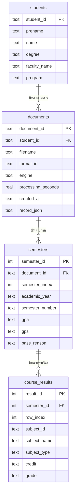
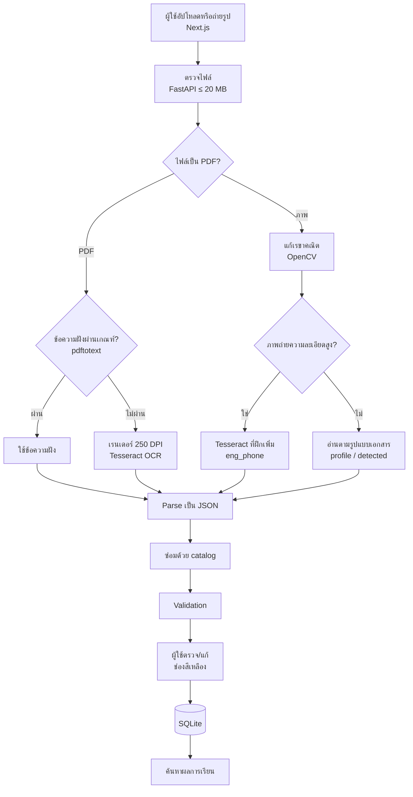
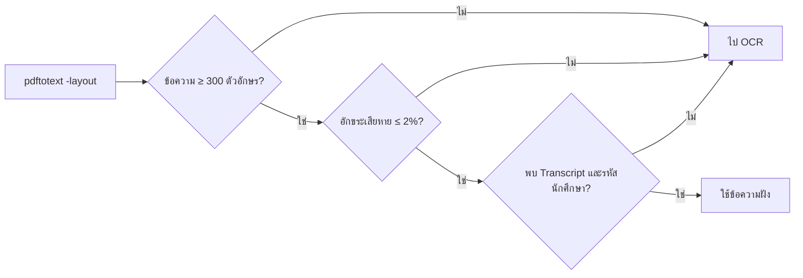
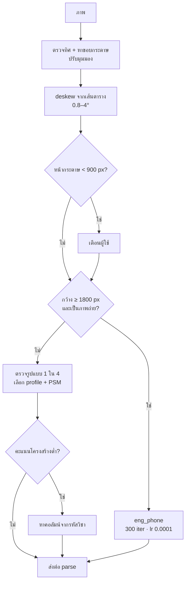
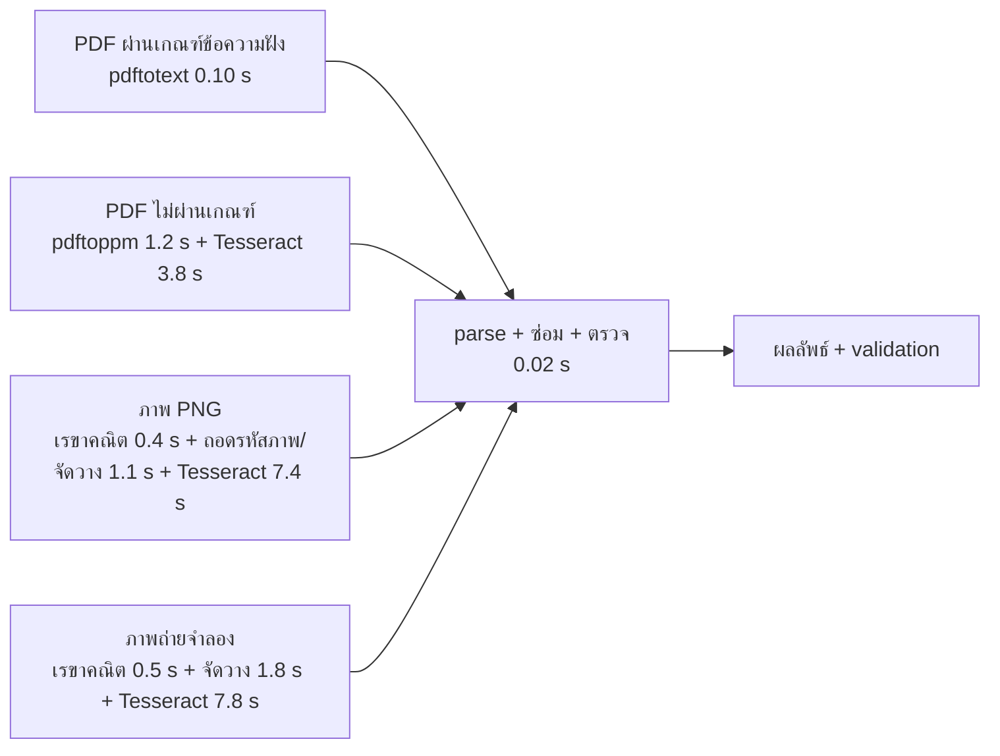

# slide.md — แผนสไลด์ + สคริปต์พูด (พรีเซนต์ 10 นาที + ถามตอบ 3 นาที)

โปรเจกต์ OCR Transcript (สจล.) · รายวิชา Intelligent System Development
จัดทำตาม `promt_slide.md` · ตัวเลขทุกตัวตรวจกับรายงานดิบใน `model/reports/` แล้ว (ดูหัวข้อ 7 สำหรับจุดที่ไม่ตรงกับ prompt)

---

## 0. ภาพรวม

### 0.1 งบเวลา (รวม Core = 9:45 นาที เหลือเผื่อ 15 วินาที)

| ช่วง | สไลด์ | เวลา | สะสม |
|---|---|---:|---:|
| **Application** (≤ 1:00 ตามอาจารย์) | S1–S2 | 0:20 + 0:40 | **1:00** |
| ภาพรวมและเหตุผล | S3–S4 | 0:35 + 0:35 | 2:10 |
| **Process / model / algorithm / parameters** (ส่วนหลัก) | S5–S10 | 0:50 + 0:50 + 0:45 + 0:50 + 0:50 + 0:55 | **7:10** |
| **ผลและเวลา** (1–2 นาที ตามอาจารย์) | S11–S13 | 0:25 + 0:45 + 0:40 | **9:00** (ใช้ 1:50) |
| ข้อจำกัดและสรุป | S14–S15 | 0:35 + 0:10 | **9:45** |
| Q&A 3 นาที | Backup B1–B9 (ถาม–ตอบ B8a, B8b) | — | — |

### 0.2 สถานะข้อมูลที่เคยขาด

| ของที่เคยขาด | สถานะ | อยู่ที่ |
|---|---|---|
| **เวลารายขั้นย่อย** (OCR / เรขาคณิต / parse / ตรวจ ...) | ✅ **วัดแล้ว** ในคอนเทนเนอร์ Docker | `model/reports/step-timing-20261009.json`, สคริปต์ `model/tools/profile_steps.py`, สไลด์ S13 และ B9 |
| **ภาพก่อน/หลังแก้เรขาคณิต** | ✅ สร้างแล้ว (ภาพจำลองเอียง+บิดมุมมองจากหน้า PDF ตัวอย่าง) | `slide_assets/geometry_before.jpg`, `slide_assets/geometry_after.png` ใช้ที่ S7 |
| **ภาพหน้าจอ application** | ✅ ถ่ายจากระบบที่รันจริงแล้ว (ดูหัวข้อ 0.3) | `slide_assets/01–09_*.png` |
| **README ขั้นตอนรัน** | ✅ เขียนแล้ว (ข้อ 1 ของ README) ทดสอบคำสั่งแล้ว | `README.MD` |
| **ชื่อกลุ่ม** | ❌ ต้องให้กลุ่มบอก ไม่มีในไฟล์ใดของโปรเจกต์ | S1 ใช้ `[ชื่อกลุ่ม]` |

ลิงก์ repo (จาก `git remote`): `https://github.com/PoohParamour/isd-2026-loso`

### 0.3 ไฟล์ภาพประกอบที่ถ่าย/สร้างแล้ว (`docs/presentation/slide_assets/`)

ถ่ายจากระบบที่ build จากโค้ดปัจจุบันและรันจริงบน Docker (โปรเจกต์ทดสอบแยก ฐานข้อมูลแยก ลบทิ้งแล้ว) ด้วย Chrome headless ขนาด 1440×900 ความละเอียด 2× (2880×1800) ใช้เอกสารตัวอย่าง `72140002.pdf` จากชุดข้อมูล (ชื่อในเอกสารเป็นข้อมูลสมมติ)

| ไฟล์ | เนื้อหา | ใช้ที่ |
|---|---|---|
| `01_upload.png` | หน้านำเข้า (ลากวาง / เลือกไฟล์ / เปิดกล้อง) | S2 |
| `02_processing.png` | หน้ากำลังประมวลผล | สำรอง |
| `03_review.png` | หน้าตรวจผลที่ผ่านการตรวจ 100% (เวลา OCR 2.68 วินาที) | S2 / วิดีโอ |
| `04_review_table.png` | ตารางรายวิชาที่อ่านได้ | สำรอง |
| `05_saved.png` | หลังกดบันทึก (ปุ่มเป็น "บันทึกแล้ว ✓") | วิดีโอ |
| `06_search_list.png` | หน้าค้นหา รายชื่อนักศึกษาทั้งหมด | S2 |
| `07_student_detail.png` | รายละเอียดนักศึกษา แยกรายภาค | B7 / วิดีโอ |
| `08_review_yellow.png` | ช่องสีเหลือง + การ์ดแจ้งเตือน (ผู้ใช้แก้ค่าผิดเพื่อสาธิต) | **S2, S10** |
| `09_review_yellow_table.png` | ตารางที่มีช่องสีเหลืองและสถานะ "ตรวจสอบ" | S10 สำรอง |
| `geometry_before.jpg` → `geometry_after.png` | ก่อน/หลังแก้เรขาคณิต (ภาพจำลอง ไม่ใช่ภาพถ่ายจริง) | **S7** |
| `charts/s04_routes.png` | กราฟเทียบเส้นทาง: ความแม่นยำ + เวลา | **S4** |
| `charts/s07_deskew.png` | กราฟก่อน/หลังเพิ่ม deskew แยกตามความเสียหาย | **S7** |
| `charts/s08_tuning.png` | กราฟความแม่นยำ dev ช่วงเลือก profile และ cell OCR | **S8** |
| `charts/s09_cer.png` | กราฟ CER ก่อน/หลังฝึก Tesseract | **S9** |
| `charts/s11_split.png` | แถบแบ่งชุดข้อมูล dev/test/ไม่มีเฉลย | **S11** |
| `charts/s12_accuracy.png` | กราฟความแม่นยำแยกชนิดอินพุต + เส้นเป้า 91% | **S12** |
| `charts/s13_stages.png` | กราฟแท่งซ้อนสัดส่วนเวลารายขั้นตอน | **S13** |
| `charts/s14_weak.png` | กราฟกลุ่มภาพที่ต่ำกว่าเป้า | **S14** |
| `charts/b04_phone.png` | กราฟผลฝึก Tesseract ภาพมือถือ (ไม่ฝึก/ฝึก, มุม 3 ก่อน/หลังแก้) | **B4** |
| `charts/b05_overfit.png` | กราฟ catalog in-sample เทียบ document-held-out | **B5** |

กราฟทั้ง 10 ภาพสร้างจากตัวเลขในรายงานดิบด้วย `charts/make_charts.py` (ภาพ PNG 3200×1800 โทนสีเดียวกับ application) ถ้าต้องการแก้ตัวเลขหรือสี ให้แก้สคริปต์แล้วเรนเดอร์ใหม่ตามวิธีในหัวไฟล์

> เอกสารตัวอย่างนี้ผ่านการตรวจโดยไม่มีช่องสีเหลือง ภาพ `08`/`09` จึงเป็นการจำลองด้วยการแก้ค่าผิดในหน้าเว็บ ต้องบอกในคำอธิบายใต้ภาพให้ชัด ถ้ากลุ่มมีเอกสารจริงที่ระบบอ่านผิดและขึ้นช่องสีเหลืองเอง ให้ใช้ภาพนั้นแทนได้

### 0.4 สี/ตัวอักษร/กฎใช้งานเดียวกันทุกหน้า

- ฟอนต์: IBM Plex Sans Thai (ตัวเดียวกับ application) · เนื้อหา ≥ 20 pt · หัวข้อ ≥ 32 pt · ตัวอักษรในกราฟ ≥ 14 pt
- สี: ส้ม `#F47721` (เน้น/ปุ่ม) · แดง `#ED0A13` (โลโก้/ต่ำกว่าเป้า) · เทาเข้ม `#292825` (ข้อความ) · ครีม `#F8F7F5` (พื้นหลัง) · เขียว `#3E8D67` (ผ่าน)
- ความหมายสีในกราฟความแม่นยำ: **เขียว = ผ่านเป้า (> 91%) · ส้ม = ผ่านแต่เป็น reused/ไม่ใช่ holdout อิสระ · แดง = ต่ำกว่าเป้า** ใช้ตลอดทั้งไฟล์
- ทุกสไลด์ Core: ชื่อสไลด์เป็นประโยคสรุป · ข้อความไม่เกิน 4 บรรทัด · ภาพ/กราฟ 1 อย่าง · มีคำอธิบายสั้น 1 บรรทัดใต้ภาพ · footnote ที่มาของตัวเลข

---

## 1. สไลด์หลัก (Core) S1–S15

> รูปแบบต่อหน้า: **ชื่อสไลด์** → **ข้อความบนสไลด์** → **ภาพ/กราฟ** → **คำอธิบายใต้ภาพ** → **Footnote** → **สคริปต์พูด**
> สคริปต์เขียนเป็นภาษาพูดแบบไม่ระบุเพศ (ไม่ใช้ครับ/ค่ะ) เติมเองตามผู้พูด

---

### S1 · ปก · 0:20

**ชื่อสไลด์:** OCR Transcript — อ่านใบแสดงผลการเรียนให้เป็นข้อมูลที่ตรวจและค้นหาได้

**ตารางบนสไลด์ (แทนรายการข้อความ)** — เหนือตาราง: ชื่อกลุ่ม **[ชื่อกลุ่ม]** ตัวใหญ่

| ลำดับ | ชื่อ-นามสกุล | รหัสนักศึกษา |
|:---:|---|:---:|
| 1 | กวีวัฒน์ สานนท์กุลวัฒน์ | 67070005 |
| 2 | ภคพล โพธิวร | 67070124 |
| 3 | ภัทรพล เพ็ชรรัตน์ | 67070127 |

**ภาพ:** ตารางสมาชิกเป็นองค์ประกอบหลัก (โลโก้ LOSO สีแดงมุมซ้ายบนได้) · **Footnote:** Intelligent System Development · สจล.

**สคริปต์พูด (≈ 20 วินาที)**
> สวัสดี กลุ่ม [ชื่อกลุ่ม] ประกอบด้วยสมาชิกสามคนตามสไลด์ โปรเจกต์ของเราคือระบบ OCR Transcript ที่อ่านใบแสดงผลการเรียนของ สจล. ทั้งไฟล์ PDF และภาพถ่าย แล้วแปลงเป็นข้อมูลที่ตรวจแก้และค้นหาได้

---

### S2 · Application · 0:40

**ชื่อสไลด์:** อัปโหลดหรือถ่ายรูป ตรวจแก้ในหน้าเดียว แล้วบันทึกและค้นหาได้

**ตารางบนสไลด์ (4 ขั้น แทนข้อความ)**

| ขั้น | ผู้ใช้ทำ | ระบบทำ | ภาพหน้าจอ |
|---|---|---|---|
| ① นำเข้า | ลากไฟล์ / เลือกหลายไฟล์ / ถ่ายด้วยกล้อง | ตรวจชนิดและขนาดไฟล์ แล้วส่งอ่าน | `01_upload.png` |
| ② ตรวจและแก้ | แก้ในช่องได้ทันที | ตรวจซ้ำอัตโนมัติ ช่องที่สงสัยเป็นสีเหลือง | `08_review_yellow.png` |
| ③ บันทึก | กด "บันทึกผลที่ตรวจแล้ว" | เก็บลง SQLite | `05_saved.png` |
| ④ ค้นหา | ค้นตามรหัสนักศึกษา / ชื่อ / รหัสวิชา | แสดงรายชื่อ และรายละเอียดรายภาค | `06_search_list.png` |

**ภาพ:** ภาพหน้าจอจริง 3 ภาพเรียงข้างกัน: `01_upload.png` (นำเข้า) · `08_review_yellow.png` (ตรวจ/แก้ มีช่องสีเหลือง) · `06_search_list.png` (ค้นหา) — ตารางด้านบนเป็นแถบอธิบายใต้ภาพ
**คำอธิบายใต้ภาพ:** ช่องสีเหลืองคือจุดที่ระบบตรวจพบว่าอ่านผิดหรือไม่ครบ แก้ได้ทันที
**Footnote:** Next.js 16 + Tailwind 4 · FastAPI · SQLite · รองรับ PDF, PNG, JPG, TIFF, HEIC ไม่เกิน 20 MB ต่อไฟล์

**สคริปต์พูด (≈ 40 วินาที)**
> ผู้ใช้ลากไฟล์เข้ามาได้เลย เลือกหลายไฟล์พร้อมกันก็ได้ หรือเปิดกล้องถ่ายใบแสดงผลการเรียนโดยตรง ระบบอ่านเสร็จจะแสดงข้อมูลนักศึกษาและรายวิชาแยกตามภาค ช่องไหนที่ระบบสงสัยจะขึ้นสีเหลือง ผู้ใช้แก้ในช่องได้ทันที ไม่ต้องแก้ไฟล์ข้อมูลเอง และระบบตรวจซ้ำให้อัตโนมัติ จากนั้นกดบันทึก แล้วค้นหาผลการเรียนย้อนหลังได้ตามรหัสนักศึกษา ชื่อ หรือรหัสวิชา

---

### S3 · ภาพรวม pipeline · 0:35

**ชื่อสไลด์:** ทุกไฟล์ผ่าน pipeline เดียว แต่แตกเส้นทางตามชนิดไฟล์

**ข้อความบนสไลด์:** บรรทัดเดียว "PDF → อ่านข้อความฝังก่อน · ภาพ → จัดให้ตรงแล้ว OCR" และตารางเส้นทางด้านล่าง (ใช้เป็นแถบใต้ flowchart หรือย้ายไป B1 ถ้าแน่น)

**ตารางบนสไลด์ — ไฟล์แต่ละชนิดไปทางไหน และใช้เวลาเท่าไร**

| ไฟล์ที่เข้า | เส้นทาง | เครื่องมือ | เวลาเฉลี่ย (วัดแล้ว) |
|---|---|---|---:|
| PDF ผ่านเกณฑ์ข้อความฝัง | ใช้ข้อความฝังทันที | pdftotext | **0.12 วินาที** |
| PDF ไม่ผ่านเกณฑ์ | เรนเดอร์ แล้ว OCR | pdftoppm + Tesseract | **5.10 วินาที** |
| ภาพทั่วไป (PNG/JPG ...) | แก้เรขาคณิต → อ่านตามรูปแบบ → OCR | OpenCV + Tesseract | **8.87 วินาที** (PNG) |
| ภาพถ่ายมือถือ | แก้เรขาคณิต → ตัวอ่านที่ฝึกเพิ่ม | OpenCV + Tesseract `eng_phone` | **27.54 วินาที** (รายงานเดิม) |

**ภาพ:** Flowchart ภาพรวม (Mermaid แผ่น A ในหัวข้อ 3.1) กล่องละชื่อขั้น + เครื่องมือ ต้องอ่านออกจากหลังห้อง
**คำอธิบายใต้ภาพ:** สีส้ม = จุดตัดสินใจ · สีเขียว = ผลลัพธ์ที่ผู้ใช้เห็น
**Footnote:** `model/extract.py` (ฟังก์ชัน `extract`)

**สคริปต์พูด (≈ 35 วินาที)**
> ภาพรวมของ pipeline มีจุดตัดสินใจสามจุด ข้อแรกไฟล์เป็น PDF หรือภาพ ถ้าเป็น PDF ที่มีข้อความฝังอยู่และคุณภาพดี เราใช้ข้อความนั้นเลย ถ้าไม่ดีหรือเป็นภาพ จะไป OCR ภาพถ่ายต้องถูกจัดให้ตรงก่อน หลังจากได้ข้อความแล้วเข้าสู่ขั้นแปลงเป็น JSON ซ่อมและตรวจสอบ แล้วส่งให้ผู้ใช้ตรวจ ก่อนบันทึกลงฐานข้อมูล

---

### S4 · ทำไมเลือก Hybrid · 0:35

**ชื่อสไลด์:** เลือก Hybrid เพราะแม่นถึง 98% และเร็วกว่า OCR ล้วนราว 7 เท่า

**ตารางบนสไลด์ (ใต้กราฟ หรือย้ายไป B2 ถ้าแน่น)**

| เส้นทาง | Exact field | เวลาเฉลี่ย | ชุดข้อมูล |
|---|---:|---:|---|
| **Hybrid** (ข้อความฝังก่อน OCR สำรอง) | **98.26%** | **0.43 วินาที** | PDF 8 ฉบับ |
| OCR ล้วน | 41.91% | 3.23 วินาที | PDF 8 ฉบับ |
| Local VLM | 1.33% | 121.1 วินาที | **ภาพ PNG 4 ฉบับ** (คนละชุด) |

**ภาพ:** กราฟ `slide_assets/charts/s04_routes.png` (กราฟแท่งคู่: ความแม่นยำ + เวลา, VLM เป็นแท่งลายทแยงและแกนเวลาถูกตัด) — ข้อมูลหัวข้อ 4.1
- ซ้าย: Exact field accuracy (%) — Hybrid 98.26 (เขียว) · OCR ล้วน 41.91 (แดง) · VLM 1.33 (แดง ลายทแยง ติดป้าย "คนละชุด: ภาพ 4 ฉบับ")
- ขวา: เวลาเฉลี่ย (วินาที) — 0.43 · 3.23 · 121.1 (แกนตัดหรือ log scale)

**คำอธิบายใต้ภาพ:** Hybrid กับ OCR ล้วนวัดบน PDF ชุดเดียวกัน 8 ฉบับ · VLM วัดบนภาพ PNG 4 ฉบับ ไม่ใช่ชุดเดียวกัน
**Footnote:** `model/reports/route-comparison-dev.json`, `vlm-dev.json` · ความเร็วของ Hybrid ขึ้นกับว่า PDF ผ่านเกณฑ์ข้อความฝังหรือไม่ (ดู S5, B9)

**สคริปต์พูด (≈ 35 วินาที)**
> ทำไมเราเลือกวิธีผสม ทดลองเทียบแล้ว บน PDF ชุดเดียวกันแปดฉบับ ใช้ข้อความฝังก่อนแล้วค่อย OCR ได้ความแม่น 98 เปอร์เซ็นต์ใช้เวลาเฉลี่ยไม่ถึงครึ่งวินาที ส่วน OCR ทุกไฟล์แม่นแค่ 42 เปอร์เซ็นต์และช้ากว่าราวเจ็ดเท่า เรายังลองโมเดลภาษาภาพ Typhoon OCR ร่วมกับ Qwen ในเครื่อง ผลคือสำเร็จแค่หนึ่งในสี่ฉบับ และใช้เวลากว่าสองนาที จึงไม่ใช้เป็นเส้นทางหลัก

---

### S5 · PDF: อ่านข้อความฝัง · 0:50

**ชื่อสไลด์:** PDF ที่มีข้อความฝังอยู่ใช้ได้ทันที ถ้าผ่าน 3 เงื่อนไขคุณภาพ

**ตารางบนสไลด์ 1 — เงื่อนไขที่ต้องผ่านทั้ง 3 ข้อ (Poppler `pdftotext -layout`)**

| # | เงื่อนไข | ค่า | ถ้าไม่ผ่าน |
|:---:|---|---|---|
| 1 | ความยาวข้อความ | ≥ 300 ตัวอักษร | ไป OCR |
| 2 | อักขระเสียหาย | ≤ 2% | ไป OCR |
| 3 | พบคำหลัก | Transcript และรหัสนักศึกษา | ไป OCR |

**ตารางบนสไลด์ 2 — ผลวัดจริง**

| ผล | จำนวนที่วัด | เวลา |
|---|---|---:|
| ผ่านเกณฑ์ (3 รูปแบบ: ป.ตรีไทย, บัณฑิตไทย/อังกฤษ) | 6 ฉบับ | 0.04–0.62 วินาที (เฉลี่ย **0.12**) |
| ไม่ผ่าน → OCR (ป.ตรีอังกฤษ ฟอนต์ Type 3 ไม่มี Unicode ข้อความเพี้ยนเป็น `ÿ`) | 2 ฉบับ | 3.2–7.5 วินาที (เฉลี่ย **5.10**) |

**ภาพ:** flowchart ย่อยแบบ diamond 3 ชั้น (Mermaid แผ่น B ในหัวข้อ 3.2) เป็นภาพหลัก · ตาราง 2 ตารางวางข้างหรือใต้ภาพ
**คำอธิบายใต้ภาพ:** บาง PDF มีข้อความฝังแต่ถอดออกมาเป็นอักขระเพี้ยน จึงต้องตรวจคุณภาพก่อนเชื่อถือ
**Footnote:** `model/extract.py` ฟังก์ชัน `text_is_usable` · ผ่านเกณฑ์: 0.04–0.62 วินาที/ฉบับ (เฉลี่ย 0.12, 6 ฉบับ) · ไม่ผ่าน (ปริญญาตรีอังกฤษ 2 ฉบับ): 3.2–7.5 วินาที · `step-timing-20261009.json`

**สคริปต์พูด (≈ 50 วินาที)**
> เริ่มจากเส้นทางที่เร็วที่สุด คือ PDF ที่มีข้อความฝัง เราใช้ pdftotext ของ Poppler ดึงข้อความออกมา แต่ไม่เชื่อทันที เพราะบางไฟล์มีข้อความฝังแต่ออกมาเป็นตัวอักษรเพี้ยน เราจึงตั้งสามเงื่อนไข ข้อความต้องยาวอย่างน้อยสามร้อยตัวอักษร อักขระเสียหายต้องไม่เกินสองเปอร์เซ็นต์ และต้องพบคำว่า Transcript พร้อมรหัสนักศึกษา ถ้าครบสามข้อ ใช้ข้อความนี้ต่อได้เลยโดยไม่ต้อง OCR ถ้าไม่ครบ ระบบส่งไปขั้น OCR แทน ตัวอย่างจริงคือ PDF ปริญญาตรีภาษาอังกฤษที่เราวัด ใช้ฟอนต์ที่ไม่มีการแมปยูนิโค้ด ข้อความที่ดึงออกมาเป็นตัวอักษรเพี้ยน ตัวตรวจคุณภาพจับได้ และระบบเปลี่ยนไป OCR

---

### S6 · OCR · 0:50

**ชื่อสไลด์:** ถ้าอ่านข้อความฝังไม่ได้ ระบบเรนเดอร์เป็นภาพแล้ว OCR ด้วย Tesseract

**ตารางบนสไลด์ (พารามิเตอร์เด่น 4 ค่า)**

| พารามิเตอร์ | ค่า | ที่มา / เหตุผลที่ระบุไว้ |
|---|---|---|
| เรนเดอร์ PDF เป็นภาพ | **250 DPI** | Poppler `pdftoppm` |
| โหมดจัดหน้าของ Tesseract | **`--psm 6`** | โหมดบล็อกข้อความ |
| ภาษา | **`eng`** → สำรอง **`tha+eng`** | อังกฤษอย่างเดียวอ่านตัวอักษรเกรด (A, B+ ...) สม่ำเสมอกว่า · สำรองเมื่อไม่พบหัวเอกสารอังกฤษ |
| ขยายภาพ | **2×** ถ้ากว้าง < 2000 px | ภาพเล็กก่อน OCR (LANCZOS) |

**ภาพ:** กล่อง 3 ขั้นต่อกัน (เรนเดอร์ → ขยาย → OCR) พร้อมตารางพารามิเตอร์ด้านบน · เวลา OCR ล้วนเฉลี่ย 3.23 วินาที/ฉบับ (`route-comparison-dev.json`)
**คำอธิบายใต้ภาพ:** อ่านภาษาอังกฤษก่อนเพราะอ่านตัวอักษรเกรด (A, B+ ...) ได้สม่ำเสมอกว่า แล้วค่อยสำรองด้วยไทย+อังกฤษ
**Footnote:** `model/extract.py` ฟังก์ชัน `read_document` (comment ในโค้ด) · เวลาเฉลี่ย OCR ทุก PDF 3.23 วินาที/ฉบับ

**สคริปต์พูด (≈ 50 วินาที)**
> เมื่อข้อความฝังใช้ไม่ได้หรือไฟล์เป็นภาพ ระบบจะ OCR ด้วย Tesseract PDF จะถูกเรนเดอร์ที่สองร้อยห้าสิบ DPI ภาพที่กว้างไม่ถึงสองพันพิกเซลจะถูกขยายสองเท่าก่อน จากนั้นอ่านด้วยโหมดจัดหน้าแบบหกซึ่งเหมาะกับบล็อกข้อความ ภาษาที่เลือกเริ่มจากอังกฤษอย่างเดียว เพราะอ่านตัวอักษรเกรดได้สม่ำเสมอกว่า ถ้าไม่พบหัวเอกสารภาษาอังกฤษ จึงสำรองด้วยไทยและอังกฤษ ซึ่งครอบคลุมเอกสารภาษาไทยด้วย

---

### S7 · ภาพถ่าย: แก้เรขาคณิต · 0:45

**ชื่อสไลด์:** ภาพถ่ายต้องถูกจัดให้ตรงก่อนอ่าน — เพิ่ม deskew แล้วภาพหมุน/สว่างแม่นขึ้น 61.8% → 74.8%

**ตารางบนสไลด์ — ผลของ deskew (ภาพ augmented 12 ภาพต่อกลุ่ม)**

| ความเสียหาย | ก่อน | หลัง | เปลี่ยน |
|---|---:|---:|---:|
| หมุน / ปรับสว่าง | 61.80% | **74.80%** | **+13.0** |
| perspective | 56.22% | **60.37%** | **+4.1** |
| noise · เบลอ · JPEG/มืด | ไม่เปลี่ยน | ไม่เปลี่ยน | 0 |
| เวลาสูงสุดต่อภาพ | 28.9 วินาที | 44.3 วินาที | +15.5 วินาที |

พารามิเตอร์: deskew มุม **0.8–4°** · เตือนเมื่อหน้ากระดาษ < **900 px**

**ภาพ:** กราฟ `slide_assets/charts/s07_deskew.png` เป็นภาพหลัก + ภาพก่อน/หลังเป็นภาพเล็กประกอบมุมสไลด์ (`slide_assets/geometry_before.jpg` → `slide_assets/geometry_after.png`: ภาพจำลองหน้า PDF ตัวอย่างหมุน 6° + บิดมุมมอง + ลดความสว่าง ผ่านฟังก์ชัน `straighten_photo` ของระบบ)
**คำอธิบายใต้ภาพ:** ภาพตัวอย่างเป็นภาพจำลอง ไม่ใช่ภาพถ่ายจริง · ตัวเลข 61.8% → 74.8% มาจากภาพ augmented กลุ่มหมุน/สว่าง (12 ภาพ) เทียบปิด/เปิดขั้น deskew
**Footnote:** OpenCV · `model/photo_geometry.py` · `augmented-dev-no-deskew-full-20261004.json`, `augmented-dev-deskew-full-20261004.json`

**สคริปต์พูด (≈ 45 วินาที)**
> ถ้าผู้ใช้ถ่ายรูปมา ภาพมักเอียงหรือหมุน ระบบจะหาขอบกระดาษและปรับมุมมองก่อน ตรวจว่าภาพกลับหัวหรือไม่ แล้วแก้ความเอียงเล็กน้อยจากเส้นตารางที่ระหว่างศูนย์จุดแปดถึงสี่องศา ถ้าหน้ากระดาษในภาพเล็กกว่าเก้าร้อยพิกเซลจะเตือนผู้ใช้ เมื่อเพิ่มขั้นแก้เอียงนี้ ภาพกลุ่มหมุนและปรับความสว่างแม่นขึ้นจากหกสิบเอ็ดจุดแปดเป็นเจ็ดสิบสี่จุดแปดเปอร์เซ็นต์ แต่ต้องแลกด้วยเวลา ภาพที่ช้าที่สุดเพิ่มจากยี่สิบเก้าเป็นสี่สิบสี่วินาที

---

### S8 · อ่านตามโครงสร้างตาราง · 0:50

**ชื่อสไลด์:** อ่านตารางตามโครงสร้างของแต่ละรูปแบบเอกสาร ไม่อ่านทั้งหน้ารวดเดียว

**ตารางบนสไลด์ (profile ของแต่ละรูปแบบ — ผลเลือกจาก 144 runs บนชุด dev)**

| รูปแบบเอกสาร | การปรับภาพ | Tesseract PSM |
|---|---|---:|
| ปริญญาตรี ไทย | original | 4 |
| ปริญญาตรี อังกฤษ | sharpen | 6 |
| บัณฑิตศึกษา ไทย | sharpen | 4 |
| บัณฑิตศึกษา อังกฤษ | autocontrast | 4 |

เพิ่มเติม: PDF ปริญญาตรีอ่านคอลัมน์ซ้ายจนจบก่อนขวา · โหมดจัดวาง `auto` เลือกวิธีด้วยคะแนนโครงสร้าง

**ภาพ:** กราฟ `slide_assets/charts/s08_tuning.png` (54.31% → 64.43% → 66.35% และแท่งทดลองที่ไม่ใช้ 63.80%) + ตาราง profile ด้านบนเป็นแถบข้างกราฟ

| รูปแบบเอกสาร | การปรับภาพ | Tesseract PSM |
|---|---|---:|
| ปริญญาตรี ไทย | original | 4 |
| ปริญญาตรี อังกฤษ | sharpen | 6 |
| บัณฑิตศึกษา ไทย | sharpen | 4 |
| บัณฑิตศึกษา อังกฤษ | autocontrast | 4 |

**คำอธิบายใต้ภาพ:** แต่ละรูปแบบมีค่าที่ดีที่สุดต่างกัน จึงไม่ใช้ค่าเดียวกับทุกไฟล์
**Footnote:** `model/reports/image-tuning-dev.json` · โหมดจัดวาง `auto` เลือกระหว่างตำแหน่งคอลัมน์สำเร็จรูปกับการหาคอลัมน์จากกรอบรหัสวิชา ด้วยคะแนนโครงสร้าง

**สคริปต์พูด (≈ 50 วินาที)**
> เอกสารสี่รูปแบบของเราคือปริญญาตรีและบัณฑิตศึกษา อย่างละภาษาไทยและอังกฤษ จัดหน้าไม่เหมือนกัน เราจึงไม่ใช้ค่าเดียวกันทุกไฟล์ PDF ปริญญาตรีมีสองคอลัมน์ ระบบอ่านซ้ายจนจบก่อนขวา ส่วนภาพ เราทดลองรวมหนึ่งร้อยสี่สิบสี่รอบบนชุด dev เพื่อเลือกวิธีปรับภาพและโหมด Tesseract ของแต่ละรูปแบบ ตามตารางนี้ ผลคือความแม่นยำของภาพในช่วงนั้นขึ้นจากห้าสิบสี่เป็นหกสิบสี่เปอร์เซ็นต์ ระบบยังหาตำแหน่งคอลัมน์จากรหัสวิชาในภาพ และเลือกวิธีที่ได้คะแนนโครงสร้างดีกว่า

---

### S9 · ภาพมือถือ: ฝึก Tesseract เพิ่ม · 0:50

**ชื่อสไลด์:** ฝึก Tesseract เพิ่มจากภาพมือถือ ลดอัตราผิดต่อตัวอักษร (CER) จาก 8.83% เหลือ 2.31%

**ตารางบนสไลด์ (การลอง 4 ชุดค่า เลือกตัวที่ CER ต่ำสุด)**

| iterations | learning rate | CER (validation) | ผล |
|---:|---:|---:|---|
| 100 | 0.0001 | 6.17% | |
| **300** | **0.0001** | **2.31%** | **เลือก** |
| 600 | 0.0001 | 2.49% | |
| 300 | 0.0003 | 2.31% | เท่ากับที่เลือก ไม่ได้ดีกว่า |

ข้อมูล: ภาพมือถือ HEIC 6 ภาพ (2 เอกสาร × 3 มุม) — ฝึก 109 บรรทัด (มุม 1) · ตรวจ 109 บรรทัด (มุม 2) · ทดสอบสุดท้ายมุม 3

**ภาพ:** กราฟ `slide_assets/charts/s09_cer.png` (CER: Tesseract ที่ติดตั้ง 8.83 · weights รุ่นก่อน 7.86 · รุ่นที่ฝึกใหม่ **2.31**) + ตารางด้านบนเป็นแถบข้างกราฟ (ตัวเลข 4 ชุดค่ามาจาก `docs/process.md`)
**คำอธิบายใต้ภาพ:** วัดบน 109 บรรทัด validation ของเอกสารเดียวกัน (2 คน × 3 มุม) ไม่ใช่เอกสารใหม่
**Footnote:** `model/reports/phone-training-summary-20261007.json`, `model/data/phone_ocr/training.json` · เตรียมข้อมูลฝึกด้วย SIFT + RANSAC จัดแนวกับ PDF

**สคริปต์พูด (≈ 50 วินาที)**
> สำหรับภาพถ่ายความละเอียดสูงจากมือถือ เราฝึก Tesseract เพิ่ม โดยปรับ LSTM ของโมเดลภาษาอังกฤษจากภาพมือถือหกภาพ เป็นเอกสารสองฉบับ ถ่ายฉบับละสามมุม ใช้มุมที่หนึ่งฝึก มุมที่สองตรวจเลือกค่า และเก็บมุมที่สามไว้ทดสอบ ลองสี่ชุดค่า เลือกสามร้อยรอบและ learning rate ศูนย์จุดศูนย์ศูนย์ศูนย์หนึ่ง ผลคืออัตราผิดต่อตัวอักษรลดจากแปดจุดแปดสามเหลือสองจุดสามหนึ่งเปอร์เซ็นต์ แต่ต้องระบุว่าเป็นเอกสารชุดเดียวกัน จึงยังไม่ใช่การพิสูจน์กับเอกสารใหม่

---

### S10 · Parse + Post-process + Validation · 0:55

**ชื่อสไลด์:** แปลงเป็น JSON แล้วตรวจกฎ — ไม่เดาค่าที่อ่านไม่ออก แต่ให้ผู้ใช้ตรวจ

**ตารางบนสไลด์ — กฎตรวจ และข้อความที่ผู้ใช้เห็น (จาก `validate.py`)**

| กฎ | เงื่อนไข | ข้อความที่ผู้ใช้เห็น |
|---|---|---|
| รหัสนักศึกษา | ตัวเลข 8 หลัก | รหัสนักศึกษาต้องเป็นตัวเลข 8 หลัก |
| รหัสวิชา | ตัวเลข 8 หลัก | รหัสวิชาต้องเป็นตัวเลข 8 หลัก |
| หน่วยกิต | จำนวนเต็ม 0–30 | หน่วยกิตต้องเป็นจำนวนเต็ม 0-30 |
| เกรด | อยู่ในรายการที่รองรับ | เกรดไม่อยู่ในรายการที่รองรับ |
| GPA | 0.00–4.00 | GPA ต้องอยู่ระหว่าง 0.00-4.00 |

หลักการ: parse ด้วย regex (ไม่ใช้ LLM) · ซ่อมด้วย catalog จากชุด dev เท่านั้น · อ่านไม่ออก → `null` + เตือน ไม่เดา

**ภาพ:** `slide_assets/08_review_yellow.png` — ช่องรหัสนักศึกษาและรหัสวิชาเป็นสีเหลือง การ์ดด้านขวาระบุ "รหัสวิชาต้องเป็นตัวเลข 8 หลัก" · หรือ `09_review_yellow_table.png` (ตาราง + สถานะ "ตรวจสอบ") — ตารางกฎวางข้างภาพหรือย้ายไป B1
**คำอธิบายใต้ภาพ:** ภาพนี้จำลองผู้ใช้แก้ค่าให้ผิด (ตัดรหัสให้เหลือ 7 หลัก) กฎตรวจรันซ้ำทุกครั้งที่แก้ช่อง และรายการแจ้งเตือนอัปเดตทันที
**Footnote:** `model/extract.py` (`parse_*`), `model/course_catalog.py`, `model/validate.py`

**สคริปต์พูด (≈ 55 วินาที)**
> ได้ข้อความแล้ว เราแปลงเป็น JSON ด้วยกฎที่แน่นอน ไม่ใช้โมเดลภาษา และไม่ใช้ชื่อไฟล์หรือเฉลยตอนอ่าน จากนั้นซ่อมข้อผิดพลาดของ OCR ด้วยทะเบียนรหัสวิชาและหัวข้อที่สร้างจากชุด dev เท่านั้น ไม่ใช้ชุด test แล้วตรวจด้วยกฎ เช่น รหัสนักศึกษาและรหัสวิชาต้องแปดหลัก หน่วยกิตศูนย์ถึงสามสิบ เกรดอยู่ในรายการ และ GPA ศูนย์ถึงสี่ ถ้าอ่านไม่ออกจริงๆ ระบบเก็บเป็นค่าว่างและเตือน ไม่เดาเพื่อให้คะแนนดูดี เพราะข้อมูลผิดที่ถูกบันทึกเงียบๆ อันตรายกว่า ผู้ใช้เห็นช่องสีเหลืองแล้วแก้ได้เลย

---

### S11 · ชุดข้อมูลและ metrics · 0:25

**ชื่อสไลด์:** ทดสอบกับ transcript จริง 48 ฉบับ แยก dev 35 · test 12 ตามเอกสารต้นทาง

**ตารางบนสไลด์ — metrics และเป้า**

| Metric | ความหมาย | เป้า |
|---|---|---|
| **Exact field accuracy** | ฟิลด์ตรงเฉลยเป๊ะ · ฟิลด์ที่หายนับว่าผิด | **> 91%** |
| Row F1 | แถวรายวิชาที่หาย/เกิน | รายงานประกอบ |
| CER | อัตราผิดต่อตัวอักษร (ใช้ตอนฝึก OCR ภาพมือถือ) | — |
| Latency | เวลาต่อฉบับ | **< 30 วินาที** เฉลี่ย |

**ภาพ:** กราฟ `slide_assets/charts/s11_split.png` (แถบแบ่ง 48 ฉบับ: dev 35 · test 12 · ไม่มีเฉลย 1) + ตาราง metrics ด้านบนใต้กราฟ
**คำอธิบายใต้ภาพ:** 47 ฉบับมีเฉลย อาจารย์อนุญาตให้ใช้ข้อมูลจริงอย่างเดียว
**Footnote:** `docs/process.md` (Decision Log) · `ground_truth_transcript/`

**สคริปต์พูด (≈ 25 วินาที)**
> เราทดสอบกับ transcript จริงสี่สิบแปดฉบับ แบ่งตามเอกสารต้นทางเป็นชุด dev สามสิบห้าฉบับไว้ปรับระบบ และชุด test สิบสองฉบับไว้วัดผล metric หลักคือ exact field accuracy ฟิลด์ต้องตรงกับเฉลยเป๊ะ ถ้าหายนับเป็นผิด เป้าที่ตั้งคือสูงกว่าเก้าสิบเอ็ดเปอร์เซ็นต์ และเวลาเฉลี่ยต่ำกว่าสามสิบวินาที

---

### S12 · ความแม่นยำแยกตามชนิดอินพุต · 0:45

**ชื่อสไลด์:** แม่นเกิน 95% กับ PDF และภาพต้นฉบับ แต่ภาพ augmented และภาพถ่ายหน้าจอยังต่ำกว่าเป้า

**ข้อความบนสไลด์ (3 บรรทัด ใต้กราฟ):** ผ่านเป้า: PDF, ภาพต้นฉบับ, ภาพ noise, ภาพมือถือ · ต่ำกว่าเป้า: ภาพ augmented 69.74% · ภาพหน้าจอ 70.50% · test ครั้งแรก (blind) 88.34% ไม่ผ่าน → ปรับแล้ว reused 97.68%

**ภาพ:** กราฟ `slide_assets/charts/s12_accuracy.png` (กราฟแท่งแนวนอน 8 แท่ง + เส้นเป้า 91%) — ข้อมูลหัวข้อ 4.2 · ตารางเต็มอยู่ B2
**คำอธิบายใต้ภาพ:** สีส้ม = ผลหลังนำข้อผิดพลาดมาปรับระบบ (reused) หรือเอกสารชุดเดียวกับที่ฝึก ไม่ใช่ holdout อิสระ
**Footnote:** `model/reports/` ตามชื่อไฟล์ในหัวข้อ 4.2 · อย่ารวมแท่งเป็นค่าเดียว เพราะเป็นคนละชนิดอินพุต

**สคริปต์พูด (≈ 45 วินาที)**
> ผลแยกตามชนิดอินพุต เพราะเอกสารแต่ละแบบยากไม่เท่ากัน PDF ได้เก้าสิบหกถึงเก้าสิบเจ็ดเปอร์เซ็นต์ ภาพต้นฉบับเก้าสิบห้าจุดเจ็ด ภาพที่มีสัญญาณรบกวนเก้าสิบสองจุดห้า และภาพมือถือเก้าสิบเจ็ดจุดสาม ที่ผ่านเป้า แต่แท่งสีส้มทั้งหมดต้องระบุว่าไม่ใช่การทดสอบอิสระ เพราะเป็นชุดที่ใช้ปรับระบบหรือเอกสารชุดเดียวกับที่ฝึก ส่วนแท่งสีแดงคือสิ่งที่ยังไม่ผ่าน ภาพที่หมุน เบลอ มืด หรือเอียงแรงได้เจ็ดสิบเปอร์เซ็นต์ ภาพถ่ายหน้าจอได้เจ็ดสิบจุดห้า และครั้งแรกที่ทดสอบ PDF แบบ blind ได้แปดสิบแปดจุดสามสี่ ก็ไม่ผ่านเช่นกัน เราจึงวิเคราะห์ข้อผิดพลาดและปรับ จนได้เก้าสิบเจ็ดจุดหกแปดในชุดเดิม

---

### S13 · ระยะเวลาที่ใช้ (รายขั้นตอน) · 0:40

**ชื่อสไลด์:** เวลาส่วนใหญ่หมดไปกับ Tesseract — ส่วน parse ซ่อม และตรวจสอบรวมกันไม่ถึง 0.03 วินาที

**ตารางบนสไลด์ (มุมขวา) — ภาพ PNG แยกตามรูปแบบเอกสาร (เวลาเฉลี่ย ฉบับละ 2 รอบ)**

| รูปแบบ | เวลา |
|---|---:|
| ปริญญาตรี ไทย | 11.04 วินาที |
| บัณฑิตศึกษา ไทย | 15.96 วินาที |
| ปริญญาตรี อังกฤษ | 4.15 วินาที |
| บัณฑิตศึกษา อังกฤษ | 4.33 วินาที |

ข้อความ 1 บรรทัดใต้ตาราง: Tesseract ใช้ **75–85%** ของเวลา · ผ่านระบบจริงทั้งชุด 12 PDF มัธยฐาน **0.078** วินาที

**ภาพ:** กราฟ `slide_assets/charts/s13_stages.png` (กราฟแท่งซ้อน 100% 4 แท่ง แบ่งสีตามขั้นตอน พร้อมเวลารวมท้ายแท่ง) — ข้อมูลหัวข้อ 4.3
**คำอธิบายใต้ภาพ:** แต่ละแท่งคือเวลาเฉลี่ยต่อไฟล์ แบ่งเป็นขั้นตอน · ภาพถ่ายจำลอง = หน้า PDF ที่หมุนและบิดมุมมอง ไม่ใช่ภาพถ่ายจริง
**Footnote:** วัดในคอนเทนเนอร์ Docker บน Apple Silicon (10 CPU) กับเอกสาร test 8 ฉบับ (รูปแบบละ 2) · ไม่รับประกันทุกเครื่อง · `model/reports/step-timing-20261009.json` · เวลาที่ผ่านระบบจริง: `challenge-api-dev.json`

**สคริปต์พูด (≈ 40 วินาที)**
> เรื่องเวลา เราวัดแยกรายขั้นตอนในคอนเทนเนอร์ Docker PDF ที่ผ่านเกณฑ์ข้อความฝังใช้เฉลี่ยศูนย์จุดหนึ่งสองวินาที เกือบทั้งหมดคือ pdftotext ถ้าต้อง OCR PDF ใช้ราวห้าวินาที ภาพใช้ประมาณเก้าถึงสิบวินาที สิ่งที่น่าสนใจคือเจ็ดสิบห้าถึงแปดสิบห้าเปอร์เซ็นต์ของเวลาหมดไปกับ Tesseract ส่วนแปลงเป็น JSON ซ่อม และตรวจสอบ รวมกันไม่ถึงสามสิบมิลลิวินาที เอกสารไทยช้ากว่าอังกฤษราวสามเท่า และเมื่อรันผ่านระบบจริงทั้งชุดสิบสองไฟล์ มัธยฐานอยู่ที่ศูนย์จุดศูนย์เจ็ดแปดวินาที

---

### S14 · ข้อจำกัดและงานต่อ · 0:35

**ชื่อสไลด์:** ยังอ่านภาพเบลอ/มืดไม่ดี และยังไม่เคยทดสอบกับเอกสารใหม่ที่ไม่เคยใช้ปรับระบบ

**ตารางบนสไลด์ — ข้อจำกัดที่ซื่อสัตย์ (แยก "สิ่งที่รู้แล้ว" ออกจาก "ที่ทำต่อ")**

| ข้อจำกัด | ตัวเลข | สิ่งที่รู้แล้ว | ที่ระบบทำให้ตอนนี้ / ทำต่อ |
|---|---:|---|---|
| ภาพเบลอ / คอนทราสต์ต่ำ | 57.18% | แก้เอียง (deskew) ไม่ช่วยกลุ่มนี้ · ลองปรับภาพและโหมด OCR เพิ่มแล้วผลไม่สม่ำเสมอ จึงไม่เปิดใช้ | **ต่อไป:** เก็บภาพเบลอเพิ่มเพื่อวิเคราะห์ข้อผิดพลาดรายภาพ (ยังไม่ได้แยกสาเหตุ) |
| ภาพ JPEG / มืด | 61.80% | deskew ไม่ช่วยกลุ่มนี้ · ยังไม่ได้แยกสาเหตุ | **ต่อไป:** วิเคราะห์ข้อผิดพลาดรายภาพ |
| ภาพมือถือยังผิด | 24/885 ฟิลด์ | ผิดที่ชื่อวิชา 13 · วันที่ 4 · เกรด 3 · ชื่อคน 2 · คำนำหน้า 1 · รหัสวิชา 1 — ส่วนรหัสนักศึกษา 6/6 และ GPA สะสม 6/6 ถูกหมด | ระบบเตือน "กรุณาเทียบกับภาพก่อนบันทึก" ทุกครั้งที่อ่านภาพถ่ายมือถือ |
| ยังไม่มีเอกสารใหม่ล้วนมาทดสอบ | — | dev/test ถูกใช้ปรับระบบแล้ว · ผลที่ผ่านเป้าเป็น reused หรือเอกสารชุดเดียวกับที่ฝึก | **ต่อไป:** เก็บเอกสารใหม่เป็น holdout อิสระ ก่อนอ้างความแม่นยำทั่วไป |

**ภาพ:** กราฟ `slide_assets/charts/s14_weak.png` (กลุ่มภาพที่ต่ำกว่าเป้า 91%) + ตารางข้อจำกัดด้านบน (วางข้างหรือใต้กราฟ)
**Footnote:** `augmented-dev-no-deskew-full-20261004.json`, `augmented-dev-deskew-full-20261004.json` · `phone-all-final-20261007.json` · การลองปรับภาพ/โหมด OCR: `docs/process.md` หัวข้อ "ตรวจ overfit และขอบเขตการเพิ่มความแม่นยำ (2026-09-24)" · คำเตือนภาพมือถือ: `model/extract.py` (`phone_photo_review`)

**สคริปต์พูด (≈ 35 วินาที)**
> ข้อจำกัดที่ต้องบอกตรงๆ มีสามเรื่อง หนึ่ง ภาพที่เบลอหรือมืดยังอ่านผิดมาก ได้ห้าสิบเจ็ดถึงหกสิบสองเปอร์เซ็นต์ การแก้เอียงไม่ช่วยกลุ่มนี้ และที่เราลองปรับภาพกับโหมด OCR เพิ่ม ผลไม่สม่ำเสมอ จึงยังไม่เปิดใช้ สอง ภาพมือถือยังผิดยี่สิบสี่ฟิลด์จากแปดร้อยแปดสิบห้า ส่วนใหญ่เป็นชื่อวิชา แต่รหัสนักศึกษาและ GPA สะสมถูกหมด และระบบเตือนให้เทียบกับภาพก่อนบันทึกทุกครั้ง สาม ชุด dev และ test ถูกใช้ปรับระบบไปแล้ว เรายังไม่ได้ทดสอบกับเอกสารใหม่ล้วนๆ จึงไม่อ้างความแม่นยำทั่วไป สิ่งที่จะทำต่อคือเก็บเอกสารใหม่เป็นชุดทดสอบอิสระ

---

### S15 · ปิด · 0:10

**ชื่อสไลด์:** ขอบคุณ — โค้ดและวิธีรันอยู่ใน repo

**ตารางบนสไลด์ — เริ่มใช้งานใน 3 ขั้น**

| ขั้น | คำสั่ง / ที่อยู่ |
|:---:|---|
| 1 | ติดตั้งและเปิด Docker Desktop |
| 2 | `git clone https://github.com/PoohParamour/isd-2026-loso.git` แล้ว `docker compose up --build` |
| 3 | เปิด `http://localhost:3000` |

**ภาพ:** QR code ไปยัง repo (ถ้าอยากใส่) · **Footnote:** ขั้นตอนเต็มอยู่ใน README ข้อ 1

**สคริปต์พูด (≈ 10 วินาที)**
> โค้ดและขั้นตอนการรันทั้งหมดอยู่ใน repo ตามสไลด์ ขอบคุณ พร้อมตอบคำถาม

---

## 2. สไลด์สำรอง (Backup) — ใช้ตอบคำถาม 3 นาที และเป็นรายละเอียดให้อาจารย์อ่านเอง

> ต่างจาก Core: หน้า Backup วางตารางเต็มได้ แต่ต้องมีชื่อสไลด์เป็นประโยคสรุปและที่มาเหมือนเดิม

### B1 · พารามิเตอร์ทุกขั้นตอน

**ชื่อสไลด์:** พารามิเตอร์ทุกขั้นของ pipeline มาจากโค้ดจริงและผ่านการเลือกจากชุด dev

| # | ขั้นตอน | เครื่องมือ | พารามิเตอร์ |
|---|---|---|---|
| 0 | ตรวจไฟล์ | FastAPI | ≤ 20 MB · ภาพ ≤ 30 ล้านพิกเซล · ตรวจ magic bytes ของ PDF/PNG/JPEG/HEIC |
| 1 | เรขาคณิตภาพ | OpenCV | deskew 0.8–4° · เตือนหน้ากระดาษ < 900 px (แนะนำ ≥ 1500 px) |
| 2 | อ่านข้อความ PDF | Poppler `pdftotext -layout` | ≥ 300 ตัวอักษร · เสียหาย ≤ 2% · ต้องพบ Transcript + รหัสนักศึกษา |
| 3 | OCR | Poppler `pdftoppm`, Tesseract, Pillow | 250 DPI · `--psm 6` · `eng` สำรอง `tha+eng` · ขยาย 2× ถ้ากว้าง < 2000 px |
| 4 | ตรวจรูปแบบ | `detect_format`, `formats.json` | 4 รูปแบบ · override ได้ |
| 5 | อ่านตามโครงสร้าง | Tesseract, `layout_ocr.py`, `cell_ocr.py` | 4 profile (original/sharpen/autocontrast + PSM 4/6) · โหมด `auto` · cell OCR กรอง confidence |
| 6 | ภาพมือถือ | Tesseract LSTM fine-tune `eng_phone` | 300 iterations · lr 0.0001 · shear ±0.03 · ใช้เมื่อภาพกว้าง ≥ 1800 px |
| 7 | Parse | Python (regex) | deterministic · ไม่ใช้ LLM |
| 8 | Post-process | `course_catalog.py` | catalog จาก dev 35 ฉบับ · GPA 0.00–4.00 · อ่านไม่ได้ = `null` |
| 9 | Validation | `validate.py` | รหัสนักศึกษา 8 หลัก · รหัสวิชา 8 หลัก · หน่วยกิต 0–30 · GPA 0–4 · ภาค 0–3 · ปี 2400–2700 |

**Footnote:** `model/extract.py`, `model/validate.py`, `backend/app/main.py`

### B2 · ตารางผลเต็ม

**ชื่อสไลด์:** ผลทั้งหมดแยกชนิดอินพุต และระบุสถานะ blind / reused

**ผังหน้า (16:9)**

| โซน | พื้นที่ | เนื้อหา |
|---|---|---|
| A | แถวบน (≈ 12%) | ชื่อสไลด์ |
| B | กลางเต็มกว้าง (≈ 55%) | ตาราง T1: ผลหลัก 8 แถว × 6 คอลัมน์ ตัวอักษร ≥ 16 pt แถบสีที่คอลัมน์ "สถานะ" |
| C | ล่างซ้าย (≈ 22%) | ตาราง T2: ภาพต้นฉบับแยกกลุ่มเอกสาร |
| D | ล่างขวา (≈ 22%) | ตาราง T3: ภาพ augmented แยกความเสียหาย |
| E | แถวล่างสุด | footnote ที่มา (ตัวเล็ก) |

**T1 — ผลหลัก** (สถานะ: เขียว = ผ่านเป้า · ส้ม = ผ่านแต่ reused/ไม่ใช่ holdout · แดง = ต่ำกว่าเป้า)

| ชุดอินพุต | ถูก/ทั้งหมด | Exact field | Row F1 | เวลาเฉลี่ย (วินาที) | สถานะ |
|---|---:|---:|---:|---:|---|
| PDF dev 35 ฉบับ | 4394/4551 | 96.55% | — | — | ส้ม · ชุดที่ใช้ปรับระบบ |
| PDF test ครั้งแรก | 1182/1338 | 88.34% | — | — | **แดง · blind ไม่ผ่าน** |
| PDF test หลังปรับ | 1307/1338 | 97.68% | — | — | ส้ม · reused |
| ภาพต้นฉบับ PNG 150 DPI (test 12 ฉบับ) | 1281/1338 | 95.74% | 100% | 9.42 | ส้ม · reused |
| ภาพ noise 47 ภาพ | 5445/5889 | 92.46% | 98.10% | 12.18 | ส้ม · dev+test รวม |
| ภาพ augmented ผสม 60 ภาพ | 4373/6270 | **69.74%** | 82.55% | 14.22 (สูงสุด 44.33) | **แดง · ต่ำกว่าเป้า** |
| ภาพมือถือ HEIC 6 ภาพ | 861/885 | 97.29% | 99.46% | 27.54 (สูงสุด 28.64) | ส้ม · เอกสารชุดเดียวกับที่ฝึก |
| ภาพถ่ายหน้าจอ 4 มุม (เอกสารเดียว) | 423/600 | **70.50%** | 76.03% | 30.90 | **แดง · dev regression** |

**T2 — ภาพต้นฉบับแยกกลุ่มเอกสาร**

| รูปแบบ | ถูก/ทั้งหมด | Exact field |
|---|---:|---:|
| ปริญญาตรี ไทย | 358/384 | 93.23% |
| ปริญญาตรี อังกฤษ | 340/347 | 97.98% |
| บัณฑิตศึกษา ไทย | 286/300 | 95.33% |
| บัณฑิตศึกษา อังกฤษ | 297/307 | 96.74% |

**T3 — ภาพ augmented แยกความเสียหาย**

| ความเสียหาย | ก่อน deskew | หลัง deskew |
|---|---:|---:|
| หมุน / ปรับสว่าง | 61.80% | **74.80%** |
| perspective | 56.22% | **60.37%** |
| noise | 94.58% | 94.58% |
| เบลอ / คอนทราสต์ต่ำ | 57.18% | 57.18% |
| JPEG / มืด | 61.80% | 61.80% |

**Footnote:** `final-dev/report.json`, `first-blind-test/report.json`, `regression-pdf-test/report.json`, `image-original-test-deskew-regression-20261004.json`, `noise-all-20260925.json`, `augmented-dev-*-20261004.json`, `phone-all-final-20261007.json`, `peam-angles-after-20261004.json`

### B3 · การทดลอง Local VLM

**ชื่อสไลด์:** Local VLM ช้าและแม่นน้อย จึงไม่เลือกเป็นเส้นทางหลัก

**ผังหน้า (16:9)**

| โซน | พื้นที่ | เนื้อหา |
|---|---|---|
| A | แถวบน | ชื่อสไลด์ |
| B | ซ้าย 50% | ตาราง T1: ตั้งค่าการทดลอง (key–value 5 แถว) |
| C | ขวา 50% | ตาราง T2: ผลแต่ละรูปแบบเอกสาร (4 แถว) |
| D | แถบล่างเต็มกว้าง | ตาราง T3: เทียบกับ Hybrid + ข้อความข้อจำกัด 1 บรรทัด |

**T1 — ตั้งค่าการทดลอง**

| หัวข้อ | ค่า |
|---|---|
| โมเดล | `scb10x/typhoon-ocr1.5-3b` → `qwen3:4b` (Ollama ในเครื่อง) |
| อินพุต | ภาพ PNG 150 DPI จากชุด dev |
| จำนวน | 4 ฉบับ (รูปแบบละ 1) |
| ขีดจำกัดเวลา | 120 วินาที (ขั้น OCR) |
| ค่า API | 0 USD |

**T2 — ผลแต่ละรูปแบบ**

| รูปแบบ | ผล | เวลา |
|---|---|---:|
| ปริญญาตรี ไทย | สำเร็จ แต่ถูก **1/75 ฟิลด์ (1.33%)** | 121.1 วินาที |
| ปริญญาตรี อังกฤษ | timeout | > 120 วินาที |
| บัณฑิตศึกษา ไทย | timeout | > 120 วินาที |
| บัณฑิตศึกษา อังกฤษ | timeout | > 120 วินาที |

**T3 — เทียบกับเส้นทางที่ใช้จริง**

| เส้นทาง | Exact field | เวลาเฉลี่ย | ชุดข้อมูล |
|---|---:|---:|---|
| **Hybrid** | **98.26%** | **0.43 วินาที** | PDF 8 ฉบับ |
| Local VLM | 1.33% | 121.1 วินาที | **ภาพ PNG 4 ฉบับ (คนละชุด)** |

ข้อจำกัดของข้อสรุป: ทดสอบบนเครื่องที่ใช้พัฒนาเท่านั้น และเพียง 4 ฉบับ
**Footnote:** `model/reports/vlm-dev.json`, `docs/process.md` (Decision Log 2026-09-20)

### B4 · การฝึก Tesseract สำหรับภาพมือถือ

**ชื่อสไลด์:** ฝึกเพิ่มลด CER ได้จริง แต่ทุกผลวัดบนเอกสารชุดเดียวกัน

**ผังหน้า (16:9)**

| โซน | พื้นที่ | เนื้อหา |
|---|---|---|
| A | แถวบน | ชื่อสไลด์ |
| B | ซ้ายบน 40% | ตาราง T1: การแบ่งข้อมูลตามมุมภาพ (3 แถว) |
| C | ซ้ายล่าง 40% | ตาราง T2: ลอง 4 ชุดค่า เลือกตัวที่ CER ต่ำสุด |
| D | ขวา 60% เต็มสูง | กราฟ `slide_assets/charts/b04_phone.png` |
| E | แถวล่างสุด | ข้อความเตือน: เอกสารชุดเดียวกัน ไม่ใช่ holdout อิสระ + footnote |

**T1 — การแบ่งข้อมูล (ภาพมือถือ HEIC 6 ภาพ = 2 เอกสาร × 3 มุม)**

| มุม | บทบาท | ข้อมูล |
|:---:|---|---|
| 1 | ฝึก | 109 บรรทัด |
| 2 | ตรวจ / เลือกค่า | 109 บรรทัด (2 ภาพ · 295 ฟิลด์) |
| 3 | ทดสอบสุดท้าย (กันไว้) | 2 ภาพ · 295 ฟิลด์ |

**T2 — การลองชุดค่า** (baseline CER: Tesseract ที่ติดตั้ง 8.83% · weights รุ่นก่อน 7.86%)

| iterations | learning rate | CER (validation) | ผล |
|---:|---:|---:|---|
| 100 | 0.0001 | 6.17% | |
| **300** | **0.0001** | **2.31%** | **เลือก** |
| 600 | 0.0001 | 2.49% | |
| 300 | 0.0003 | 2.31% | เท่ากับที่เลือก ไม่ได้ดีกว่า |

**กราฟ D:** ไม่ฝึก 84.75% → ฝึกแล้ว 97.63% (มุม 2) · มุม 3 ครั้งแรก 85.42% (ตรวจขอบกระดาษไม่ผ่านในบางภาพ และมีขอบมืดรวมบรรทัดหัวเอกสาร) → หลังแก้ geometry 97.29% **ต้องเรียก reused** ไม่ใช่ blind · ทั้ง 6 ภาพ 97.29% (row F1 99.46%, รหัสนักศึกษา 6/6, GPA สะสม 6/6)
**วิธีเตรียมข้อมูล:** จัดแนว PDF ต้นฉบับกับภาพด้วย SIFT + RANSAC (ใช้ตอนเตรียมข้อมูลฝึกเท่านั้น ไม่ใช้ตอนอ่านจริง)
**Footnote:** `phone-training-summary-20261007.json`, `model/data/phone_ocr/training.json` (ตาราง T2 ส่วน 100/600 iterations และ lr 0.0003 มาจาก `docs/process.md`)

### B5 · ป้องกัน overfit

**ชื่อสไลด์:** กัน catalog ออกทั้งฉบับ ผลลดลงเพียง 2.3 จุด แต่ยังไม่ใช่ holdout อิสระของทั้งระบบ

**ผังหน้า (16:9)**

| โซน | พื้นที่ | เนื้อหา |
|---|---|---|
| A | แถวบน | ชื่อสไลด์ |
| B | ซ้าย 55% | กราฟ `slide_assets/charts/b05_overfit.png` (3 แท่ง + เส้นเป้า 91%) |
| C | ขวา 45% | ตาราง T1: มาตรการป้องกัน และข้อจำกัดที่เหลือ |
| D | แถวล่างสุด | footnote ที่มา |

**T1 — ทำอะไรไปแล้ว / อะไรที่ยังเป็นข้อจำกัด**

| มาตรการ | สถานะ | หมายเหตุ |
|---|:---:|---|
| catalog รหัสวิชา/หัวข้อ สร้างจากชุด dev เท่านั้น | ✓ ทำแล้ว | ไม่ใช้ชุด test |
| วัดแบบกันเอกสารที่กำลังวัดออกจาก catalog ทั้งฉบับ | ✓ ทำแล้ว | `model/tools/benchmark_catalog_cv.py` |
| ไม่ใช้เฉลยหรือชื่อไฟล์ตอนอ่าน (inference) | ✓ ทำแล้ว | parse ด้วยกฎล้วน |
| parser/heuristic เคยปรับบนชุด dev | ✗ ข้อจำกัด | จึงไม่ใช่ holdout อิสระของทั้งระบบ |
| ชุด test ถูกใช้วิเคราะห์ข้อผิดพลาดแล้ว | ✗ ข้อจำกัด | ผลหลังปรับเรียก reused |

**Footnote:** `noise-dev-term-fix.json` (94.42%), `noise-dev-catalog-held-out.json` (92.11%), `original-dev-catalog-held-out-all.json` (92.11%)

### B6 · การตรวจเฉลย (audit)

**ชื่อสไลด์:** เฉลยบางจุดไม่ตรงกับเอกสารจริง จึงรายงานคะแนนทั้งแบบตามเฉลยเดิมและแบบตามเอกสาร

**ผังหน้า (16:9)**

| โซน | พื้นที่ | เนื้อหา |
|---|---|---|
| A | แถวบน | ชื่อสไลด์ |
| B | ซ้าย 45% | ตาราง T1: ประเภทที่เฉลยไม่ตรง (4 แถว รวม 23 ฟิลด์ จาก test 12 ฉบับ) |
| C | ขวา 55% | ตาราง T2: คะแนนในแต่ละวิธีคิด (3 แถว) · ใต้ตารางเป็นกล่องข้อความ "รุ่นก่อนหน้า" |
| D | แถบล่าง | ข้อความ: ไม่แก้เฉลยต้นฉบับ เก็บ audit แยก + footnote |

**T1 — เฉลยที่ไม่ตรงกับเอกสาร (test 12 ฉบับ)**

| ประเภท | จำนวนฟิลด์ |
|---|---:|
| วันที่ออกเอกสาร (`footer_detail.updated_at`) ไม่ตรงภาพ | 10 |
| ฟิลด์ของภาคสุดท้ายที่ไม่ปรากฏในเอกสาร | 12 |
| หน่วยกิตรวมไม่ตรง | 1 |
| **รวม** | **23** |

**T2 — คะแนนแต่ละวิธีคิด (รุ่นปัจจุบัน)**

| วิธีคิด | ถูก/ทั้งหมด | Exact field |
|---|---:|---:|
| ตามเฉลยเดิม (raw) | 1281/1338 | **95.74%** |
| ตัดฟิลด์ที่เฉลยไม่ตรงทั้ง 23 ออก (conservative) | 1281/1315 | 97.41% |
| ตามเอกสารที่มองเห็น (เพิ่ม 11 ค่าที่ OCR ตรงเอกสาร ตัด 12 ฟิลด์ที่ไม่มีในเอกสาร) | 1292/1326 | 97.44% |

**รุ่นก่อนหน้า (ตัวอย่างที่ audit มีผลต่อเป้า 91%):** ตามเฉลยเดิม 1211/1338 = 90.51% · ตามภาพที่ตรวจแล้ว 1221/1338 = 91.26% (แก้ 10 จุดวันที่ที่ OCR ตรงกับเอกสาร)
**หลักการ:** ไม่แก้เฉลยต้นฉบับ รายงานคะแนนตามเฉลยเดิม (raw) ก่อนเสมอ แล้วจึงแสดงคะแนนตามเอกสารเป็นข้อมูลเสริม
**Footnote:** `ground-truth-audit-test-expanded.json`, `ground-truth-audit-test.json`, `image-original-test-audited-score.json`

### B7 · ฐานข้อมูล API และวิธีรัน

**ชื่อสไลด์:** ฐานข้อมูล SQLite 4 ตาราง และ API 8 endpoint รันได้ด้วยคำสั่งเดียว

**ผังหน้า (16:9)**

| โซน | พื้นที่ | เนื้อหา |
|---|---|---|
| A | แถวบน | ชื่อสไลด์ |
| B | ซ้าย 50% | แผนภาพ ER (Mermaid ด้านล่าง) |
| C | ขวา 50% | ตาราง T1: API 8 endpoint |
| D | แถบล่างเต็มกว้าง | ตาราง T2: วิธีรัน 3 ขั้น |

**แผนภาพ ER**

**T1 — API**

| Method | Path | ใช้ทำอะไร |
|---|---|---|
| POST | `/api/transcripts/extract` | อัปโหลดไฟล์ → ผล OCR + validation |
| POST | `/api/validate` | ตรวจข้อมูลซ้ำหลังผู้ใช้แก้ |
| POST | `/api/documents` | บันทึกผลที่ตรวจแล้ว |
| GET | `/api/documents/{id}` | เปิดเอกสารที่บันทึกไว้ |
| GET | `/api/students` | รายชื่อนักศึกษา (ฉบับล่าสุดของแต่ละคน) |
| GET | `/api/grades?student_id=&subject_id=` | ผลรายวิชา |
| GET | `/api/suggest?kind=&q=` | รายการแนะนำรหัส |
| GET | `/api/health` | สถานะ (Tesseract, pdftotext, รูปแบบเอกสาร) |

**T2 — วิธีรัน**

| ขั้น | คำสั่ง / ที่อยู่ |
|:---:|---|
| 1 | ติดตั้งและเปิด Docker Desktop |
| 2 | `git clone https://github.com/PoohParamour/isd-2026-loso.git` แล้ว `docker compose up --build` |
| 3 | เปิด `http://localhost:3000` (ขั้นตอนเต็มใน README ข้อ 1) |

ข้อมูลเสริม: foreign key เปิดใช้ (`PRAGMA foreign_keys = ON`) · ลบเอกสารแล้วภาค/รายวิชาถูกลบตาม (cascade) · มี index ที่ `course_results(subject_id)` และ `documents(student_id)`
**Footnote:** `backend/app/main.py`, `backend/app/database.py`, `docker-compose.yml`

### B8a · ถาม–ตอบ (1/2) วิธีการและความเสี่ยง

**ชื่อสไลด์:** คำถามเรื่องวิธีการและความน่าเชื่อถือของผล

**ผังหน้า (16:9)**

| โซน | พื้นที่ | เนื้อหา |
|---|---|---|
| A | แถวบน | ชื่อสไลด์ |
| B | ตัวหน้า เต็มกว้าง | ตาราง 3 คอลัมน์ × 6 แถว (คำถาม 25% · คำตอบ 60% · เปิดหน้า 15%) ตัวอักษร ≥ 16 pt |

| คำถาม | คำตอบ (พูดไม่เกิน 20 วินาที) | เปิดหน้า |
|---|---|---|
| ทำไมไม่ใช้ LLM/VLM อ่านเลย | ลองแล้ว Typhoon OCR + Qwen สำเร็จ 1/4 ฉบับ ถูก 1.33% ใช้ 121 วินาที ส่วน Hybrid 98.26% ใน 0.43 วินาที parser เป็นกฎที่แน่นอน จึงไม่แต่งข้อมูล | B3, S4 |
| ผลนี้ overfit หรือไม่ | ลดความเสี่ยงโดยสร้าง catalog จาก dev เท่านั้น วัดแบบกันเอกสารออกได้ 92.11% เทียบ in-sample 94.42% แต่ parser ปรับบน dev และ test ถูกใช้แล้ว จึงยังไม่ใช่ holdout อิสระ | B5 |
| blind กับ reused ต่างกันอย่างไร | blind คือทดสอบครั้งแรกก่อนแก้ ได้ 88.34% ไม่ผ่าน พอนำข้อผิดพลาดมาปรับแล้ววัดซ้ำชุดเดิมเรียก reused ได้ 97.68% | S12, B2 |
| ข้อมูลที่อ่านไม่ออกจัดการอย่างไร | เก็บเป็นค่าว่าง ขึ้นช่องสีเหลืองและคำเตือน ให้ผู้ใช้ตรวจแก้ก่อนบันทึก ไม่เดาค่า | S10 |
| เฉลยผิดหรือเปล่า | พบเฉลยไม่ตรงเอกสาร 23 ฟิลด์จาก test 12 ฉบับ (วันที่ 10 · ภาคสุดท้ายที่ไม่มีในเอกสาร 12 · หน่วยกิต 1) จึงรายงานทั้งคะแนนตามเฉลยเดิมและตามเอกสาร | B6 |
| ทำไมใช้ข้อมูลจริงอย่างเดียว | อาจารย์อนุญาตให้ใช้ข้อมูลจริงอย่างเดียว ไม่บังคับ synthetic | S11 |

### B8b · ถาม–ตอบ (2/2) ผลและเวลา

**ชื่อสไลด์:** คำถามเรื่องความแม่นยำ เวลา และการรองรับเอกสาร

**ผังหน้า (16:9):** เหมือน B8a (ตาราง 3 คอลัมน์ × 6 แถว)

| คำถาม | คำตอบ (พูดไม่เกิน 20 วินาที) | เปิดหน้า |
|---|---|---|
| ทำไมภาพ augmented ต่ำ (69.74%) | กลุ่มที่ต่ำคือเบลอ/คอนทราสต์ต่ำ 57.18% · perspective 60.37% · JPEG/มืด 61.80% ส่วนหมุน/สว่างดีขึ้นเป็น 74.80% หลังเพิ่ม deskew เราลองปรับภาพและโหมด OCR เพิ่มแล้วผลไม่สม่ำเสมอ จึงไม่เปิดใช้ และยังไม่ได้แยกสาเหตุรายภาพ จึงไม่อ้างว่ารองรับทุกสภาพภาพ | B2, S7, S14 |
| รองรับเอกสารกี่แบบ | 4 รูปแบบ (ป.ตรี/บัณฑิต × ไทย/อังกฤษ) ตรวจอัตโนมัติหรือเลือกเอง · อินพุต PDF, PNG, JPG, TIFF, HEIC | B1 |
| ภาพมือถือ 27.5 วินาทีช้าไปไหม | ผ่านเป้าเฉลี่ย < 30 วินาที แต่ใกล้เส้น และ augmented สูงสุด 44.33 วินาทีเกินเป้า เป็นข้อแลกเปลี่ยนกับความแม่นยำ | S13, S7 |
| เวลาส่วนใหญ่หมดไปกับอะไร | Tesseract 75–85% ของเวลาในเส้นทาง OCR ส่วน parse/ซ่อม/ตรวจรวมกันไม่ถึง 0.03 วินาที ถ้าจะเร่งต้องเร่งที่ OCR | B9, S13 |
| ทำไม PDF บางไฟล์ช้า (5 วินาที) | PDF ปริญญาตรีอังกฤษที่วัดใช้ฟอนต์ Type 3 ไม่มี Unicode ข้อความฝังเพี้ยน ตัวตรวจคุณภาพจึงส่งไป OCR แทน เป็นการป้องกันข้อมูลผิดโดยแลกกับเวลา | S5, B9 |
| ลองเครื่องมือ OCR อื่นไหม | ทดลอง tessdata_best และ RapidOCR ใน checkpoint เอกสารกลุ่ม แต่ไม่ได้ใช้ในเส้นทางสุดท้าย | `docs/process.md` (2026-10-04) |

### B9 · เวลารายขั้นตอน (รายละเอียดและวิธีวัด)

**ชื่อสไลด์:** Tesseract ใช้ 75–85% ของเวลาในเส้นทาง OCR ส่วนขั้นที่เป็นกฎ (parse/ซ่อม/ตรวจ) ใช้ไม่ถึง 0.03 วินาที

**ผังหน้า (16:9)**

| โซน | พื้นที่ | เนื้อหา |
|---|---|---|
| A | แถวบน | ชื่อสไลด์ |
| B | บน เต็มกว้าง (≈ 40%) | กราฟ `slide_assets/charts/s13_stages.png` (ใช้ภาพเดียวกับ S13 ย่อขนาด) |
| C | ล่างซ้าย 55% | ตาราง T1: เวลาแต่ละเส้นทาง (5 แถว) |
| D | ล่างขวา 45% | ตาราง T2: เวลาแยกรูปแบบเอกสาร (4 แถว) |
| E | แถบล่างสุด | 3 กล่องข้อควรระวัง + footnote |

**T1 — เวลาแต่ละเส้นทาง**

| เส้นทาง | เฉลี่ย | ช่วง (ต่ำสุด–สูงสุด) | ขั้นที่ใช้เวลามากสุด |
|---|---:|---|---|
| PDF ผ่านเกณฑ์ข้อความฝัง | 0.12 วินาที | 0.04–0.62 | pdftotext 80% |
| PDF ไม่ผ่านเกณฑ์ → OCR | 5.10 | 3.20–7.45 | Tesseract 75% · Poppler render 24% |
| PDF บังคับ OCR (8 ฉบับ × 2) | 8.68 | 1.19–34.58 | Tesseract 85% · Poppler render 14% |
| ภาพ PNG 150 DPI (8 ฉบับ × 2) | 8.87 | 3.52–18.51 | Tesseract 84% |
| ภาพถ่ายจำลอง (2 ฉบับ × 2) | 10.22 | 6.14–14.44 | Tesseract 77% · จัดวาง 12% |

**T2 — เวลาแยกรูปแบบเอกสาร (ภาพ PNG ฉบับละ 2 รอบ)**

| รูปแบบ | เวลาเฉลี่ย |
|---|---:|
| ปริญญาตรี ไทย | 11.04 วินาที |
| บัณฑิตศึกษา ไทย | 15.96 วินาที |
| ปริญญาตรี อังกฤษ | 4.15 วินาที |
| บัณฑิตศึกษา อังกฤษ | 4.33 วินาที |

→ **เอกสารภาษาไทยช้ากว่าอังกฤษราว 3 เท่า** (ตัวอย่างเพียง 2 ฉบับต่อรูปแบบ)

**กล่องข้อควรระวัง (โซน E)**
1. ภาพถ่ายจำลองไม่ใช่ภาพถ่ายจริง ใช้ดูสัดส่วนเวลาเท่านั้น (เอกสารไทยที่จำลองอ่านได้เพียง 3 วิชา จึงไม่ใช้อ้างความแม่นยำ)
2. เวลาเปลี่ยนตามเครื่องและโหลด · เวลาภาพมือถือจริงและ augmented มาจากรายงานเดิม ไม่ได้แยกขั้นตอน
3. วิธีวัด: รัน `extract()` จริงในคอนเทนเนอร์ (Linux aarch64 บน Docker Desktop, 10 CPU) กับเอกสาร test 8 ฉบับ (รูปแบบละ 2) ตัวจับเวลาครอบแต่ละขั้นแบบ exclusive · รอบวัด PDF ข้อความฝัง 3 รอบ ที่เหลือ 2 รอบ

**Footnote:** `model/reports/step-timing-20261009.json` · สคริปต์ `model/tools/profile_steps.py`

---

## 3. Flowchart (Mermaid)

### 3.1 แผ่น A — ภาพรวม end-to-end (ใช้ใน S3)

### 3.2 แผ่น B — เกณฑ์ข้อความฝังของ PDF (ใช้ใน S5)

### 3.3 แผ่น C — เส้นทางภาพ (ใช้ใน S7–S9 ถ้าต้องการแผนผังแทนภาพ)

### 3.4 แผ่น D — เส้นทางกำกับเวลาเฉลี่ยที่วัดได้ (ใช้แทน/ประกอบ S13 ได้)

---

## 4. ข้อมูลกราฟ (นำไปวางใน Canva / PowerPoint ได้ตรงๆ)

### 4.1 S4 — เทียบเส้นทาง

| เส้นทาง | Exact field (%) | เวลาเฉลี่ย (วินาที) | ชุดข้อมูล | สี |
|---|---:|---:|---|---|
| Hybrid | 98.26 | 0.433 | PDF 8 ฉบับ | เขียว |
| OCR ล้วน | 41.91 | 3.227 | PDF 8 ฉบับ | แดง |
| Local VLM | 1.33 | 121.1 | **ภาพ PNG 4 ฉบับ** | แดง ลายทแยง |

### 4.2 S12 — ความแม่นยำ (เรียงตามนี้ เส้นเป้า 91)

| แท่ง | Exact field (%) | สี | หมายเหตุ (ติดป้ายเล็ก) |
|---|---:|---|---|
| PDF dev | 96.55 | ส้ม | ชุดที่ใช้ปรับระบบ |
| PDF test (blind ครั้งแรก) | 88.34 | แดง | ต่ำกว่าเป้า |
| PDF test (reused) | 97.68 | ส้ม | หลังปรับ |
| ภาพต้นฉบับ test | 95.74 | ส้ม | reused |
| ภาพ noise 47 ภาพ | 92.46 | ส้ม | |
| ภาพมือถือ 6 ภาพ | 97.29 | ส้ม | เอกสารชุดเดียวกับที่ฝึก |
| ภาพ augmented 60 ภาพ | 69.74 | แดง | |
| ภาพถ่ายหน้าจอ 4 มุม | 70.50 | แดง | เอกสารเดียว |

> หมายเหตุสี: ไม่มีแท่งสีเขียวล้วน เพราะทุกชุดที่ผ่านเป้าถูกใช้ปรับระบบหรือเป็นเอกสารเดียวกับที่ฝึกแล้ว — ซื่อสัตย์กว่าโชว์เขียว (ถ้ากลุ่มมีชุดทดสอบอิสระใหม่ภายหลังค่อยเติมแท่งเขียว)

### 4.3 S13 — เวลาเฉลี่ยต่อไฟล์ แบ่งตามขั้นตอน (วินาที) · กราฟแท่งซ้อน

ที่มา `model/reports/step-timing-20261009.json` · วัดแบบ exclusive (เวลาของแต่ละขั้นไม่รวมขั้นที่มันเรียกใช้) จึงรวมกันได้เท่ากับเวลาทั้งหมด

| แท่ง (จำนวนที่วัด) | Tesseract OCR | Poppler (render/ดึงข้อความ) | เรขาคณิต OpenCV | จัดวาง/ถอดรหัสภาพ | parse+ซ่อม+ตรวจ | อื่นๆ | **รวม** |
|---|---:|---:|---:|---:|---:|---:|---:|
| PDF ผ่านเกณฑ์ข้อความฝัง (6 ฉบับ × 3 รอบ) | 0 | 0.099 | 0 | 0 | 0.022 | 0.002 | **0.12** |
| PDF ไม่ผ่านเกณฑ์ → OCR (ปริญญาตรีอังกฤษ 2 ฉบับ × 3 รอบ) | 3.825 | 1.254 | 0 | 0.014 | 0.010 | 0.002 | **5.10** |
| ภาพ PNG 150 DPI (8 ฉบับ × 2 รอบ) | 7.405 | 0 | 0.394 | 1.058 | 0.005 | 0.007 | **8.87** |
| ภาพถ่ายจำลอง (2 ฉบับ × 2 รอบ) | 7.838 | 0 | 0.458 | 1.772 | 0.008 | 0.140 | **10.22** |

สี: Tesseract = ส้มเข้ม · Poppler = ส้มอ่อน · เรขาคณิต = เทาเข้ม · จัดวาง/ถอดรหัสภาพ = เทากลาง · parse/ซ่อม/ตรวจ = เขียว · อื่นๆ = เทาอ่อน

เวลาเส้นทางอื่นจากรายงานเดิม (ใส่ใน B9 ไม่ต้องอยู่ใน S13): PDF ผ่านระบบจริง 12 ฉบับ มัธยฐาน 0.078 · เฉลี่ย 1.754 · สูงสุด 14.972 · ภาพ noise 12.18 · ภาพ augmented 14.22 (สูงสุด 44.33) · ภาพมือถือ 27.54 (สูงสุด 28.64) · Local VLM 121.1 (ไม่ใช้)

### 4.4 S9 — CER ภาพมือถือ (%)

| รุ่น | CER |
|---|---:|
| Tesseract ที่ติดตั้ง | 8.83 |
| weights จากภาพรุ่นก่อน | 7.86 |
| รุ่นที่ฝึกใหม่ (300 iter) | 2.31 |

---

## 5. สคริปต์เสียงบรรยายวิดีโอสาธิต (ไม่บังคับ — ใช้คู่กับ README ข้อ 1)

> อาจารย์ต้องการวิดีโอตั้งแต่ "ปิดเครื่องแล้วเปิดใหม่" พร้อมเสียงบรรยาย ลำดับที่แนะนำ (ตรงกับคำสั่งที่ทดสอบแล้ว):

1. เปิดเครื่อง เปิด Docker Desktop รอจนสถานะพร้อม
2. เปิด Terminal ไปที่โฟลเดอร์โปรเจกต์ที่ clone มา
3. รัน `docker compose up --build` (ครั้งแรกใช้เวลาหลายนาที — ตัดต่อย่นได้ แต่ให้บอกในเสียงบรรยายว่าตัดช่วงรอ)
4. รอข้อความว่า backend healthy แล้ว web ขึ้น
5. เปิด `http://localhost:3000` แสดงหน้านำเข้า
6. อัปโหลด PDF 1 ไฟล์ → แสดงผลอ่านและเวลาที่ใช้ → ชี้ช่องสีเหลือง → แก้ 1 ช่อง → แสดงสถานะตรวจซ้ำ → บันทึก
7. อัปโหลดภาพถ่าย 1 ภาพ (หรือเปิดกล้อง) → แสดงผล
8. ไปหน้าค้นหา → เห็นรายชื่อ → คลิกเข้ารายละเอียดรายภาค → ค้นด้วยรหัสวิชา
9. ปิดด้วย `docker compose down`

---

## 6. ตรวจรายการตาม prompt (checklist ท้ายงาน)

| ข้อกำหนดในโจทย์ | อยู่ที่ |
|---|---|
| ชื่อและรหัสนักศึกษา | S1 (ชื่อกลุ่มรอกลุ่ม) |
| Application ≤ 1 นาที | S1–S2 รวม 1:00 |
| Flowchart + ขั้นตอนทำอะไร | S3, S5–S10, หัวข้อ 3 |
| ใช้ model/library/tools อะไร | S5–S10, B1 |
| Algorithm และ parameters | S5–S10, B1 |
| ผล + evaluation metrics + วิเคราะห์ | S11–S12, S14, B2–B6 |
| ระยะเวลาแต่ละขั้นตอน | S13, B9, หัวข้อ 3.4 และ 4.3 (วัดรายขั้นแล้ว) |
| แยก blind/reused และชนิดอินพุต | S12, B2 |
| สไลด์ 10 นาที / Q&A 3 นาที | หัวข้อ 0.1 / B8a, B8b |
| ส่งเป็น PDF | ทำตอนส่งออกจากเครื่องมือสไลด์ (ตรวจว่าภาษาไทยไม่แตก) |

---

## 7. รายงานความไม่ตรงกันระหว่าง `promt_slide.md` กับรายงานดิบ (ใช้ค่าจากรายงานดิบในไฟล์นี้)

| จุด | ใน `promt_slide.md` / `docs/process.md` | รายงานดิบ | ที่ใช้ในสไลด์ |
|---|---|---|---|
| PDF dev | 4397/4551 = 96.62% | `final-dev/report.json` และผลรวม `documents.csv` = **4394/4551 = 96.55%** (ไม่พบรายงานดิบที่ให้ 4397) | **96.55%** |
| PDF test (reused) | 1307/1338 = 97.68% | `regression-pdf-test/report.json` = 1307/1338 = **97.68%** ✓ (ส่วน `final-test/report.json` เป็นรุ่นเก่า 1306/1338 = 97.61%) | 97.68% |
| ภาพต้นฉบับแยกกลุ่ม | ป.ตรีอังกฤษ 96.54% · บัณฑิตไทย 96.33% · บัณฑิตอังกฤษ 95.77% (รุ่น 95.96%) | รุ่นปัจจุบัน 95.74%: ป.ตรีไทย 93.23% · **ป.ตรีอังกฤษ 97.98%** · **บัณฑิตไทย 95.33%** · **บัณฑิตอังกฤษ 96.74%** | ค่าจากรายงานดิบ |
| เวลาเฉลี่ยภาพต้นฉบับ | ราว 5.6–8.8 วินาที | รุ่นปัจจุบัน: **9.42** (เปิด deskew) / 10.87 (ปิด) | 9.42 |
| เวลาเฉลี่ยภาพ noise | ราว 9 วินาที | `noise-all-20260925.json` = **12.18 วินาที** | 12.18 |
| ตรวจแล้วตรงกัน | augmented 4373/6270 (14.22/44.33 s), noise 5445/5889, ภาพมือถือ 861/885 (27.539 s, สูงสุด 28.641), VLM 1/75 (121.1 s), Hybrid vs OCR ล้วน 565/575 vs 241/575 (0.433 vs 3.227 s), API batch (มัธยฐาน 0.078 s), held-out 92.11% vs 94.42%, ฝึก CER 8.83% → 2.31%, หน้าจอ 423/600 | ✓ ตรงทุกค่า | — |
| เวลา Hybrid บน PDF | `route-comparison-dev.json`: เฉลี่ย 0.433 วินาที (8 ฉบับ dev) | รอบวัดใหม่ (test 8 ฉบับ): ผ่านเกณฑ์ 0.12 วินาที แต่ PDF ปริญญาตรีอังกฤษไม่ผ่านเกณฑ์ใช้ 5.10 วินาที ค่าเฉลี่ยรวมจึงขึ้นกับสัดส่วนเอกสาร | ใช้ทั้งสองและระบุเงื่อนไข (S4, S5, B9) |
| ยังไม่ได้ตรวจกับรายงานดิบ | เฉลยวันที่ไม่ตรงภาพ 10/12 และ 90.51%/91.26% (B6) · แยกกลุ่ม noise (graduate_th 89.39%) | อ้างจาก `docs/process.md` | ติดป้ายในสไลด์ B6 แล้ว |
